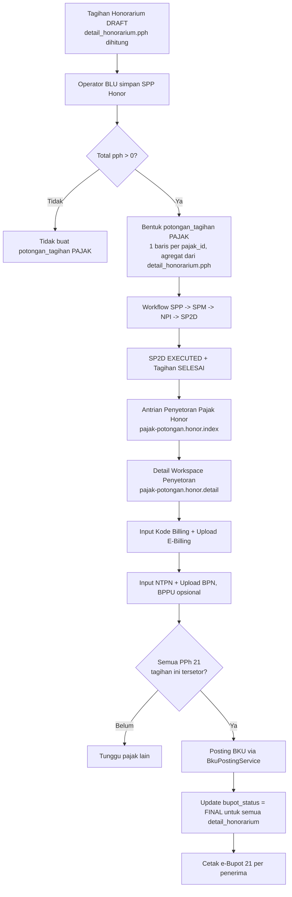
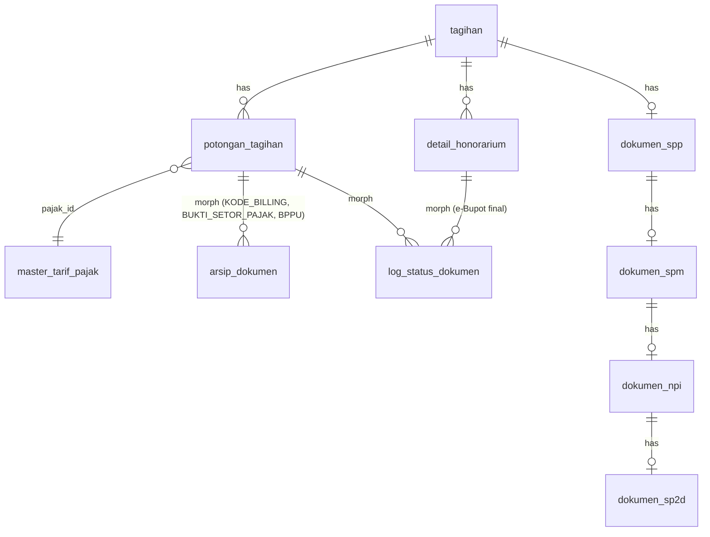

# Design Document

Penyetoran Pajak Honorarium (PPh 21) — SIKEREN-BLU

## Overview

Fitur **Penyetoran Pajak Honorarium** memperluas siklus pembayaran honorarium pada SIKEREN-BLU dengan menambahkan tahap penyetoran PPh 21 ke kas negara oleh Bendahara Pengeluaran. Saat ini sistem sudah:

- Menghitung `pph` per `detail_honorarium` saat tagihan honor disusun.
- Menerbitkan SPP/SPM/NPI/SP2D dan menandai SP2D sebagai `EXECUTED` setelah bukti transfer di-upload.
- Memiliki pola `PenyetoranPajakKontrakController` yang menangani input ID Billing → NTPN → posting BKU untuk tagihan kontrak.

Yang belum ada:

- Pembentukan baris `potongan_tagihan` (`jenis_potongan = 'PAJAK'`) untuk PPh 21 honorarium pada saat SPP honor disimpan. Saat ini `SppController::storeHonor` belum melakukan ini.
- Kontroler khusus penyetoran pajak honorarium (`PenyetoranPajakHonorController`).
- Dukungan e-Bupot 21 per penerima honorarium.
- Panel "Penyetoran Pajak Honorarium" pada dashboard Bendahara Pengeluaran.

Desain ini mengikuti pola yang sudah berjalan pada `PenyetoranPajakKontrakController`, dengan tiga penyesuaian utama untuk karakteristik honorarium:

1. **Agregasi pajak per tagihan honor**. PPh 21 dipotong dari banyak `detail_honorarium`, namun disetorkan secara agregat per jenis pajak (`pajak_id`) ke kas negara. Sistem membentuk satu baris `potongan_tagihan` per pasangan (`tagihan_id`, `pajak_id`).
2. **Reuse BKU posting**. `BkuPostingService::postTagihanPengeluaran` digunakan apa adanya; tidak ada perubahan pada layanan tersebut.
3. **Bukti potong per penerima (e-Bupot 21)**. Setiap baris `detail_honorarium` berhak atas satu Bukti Pemotongan PPh 21 yang dapat dicetak setelah seluruh PPh 21 atas tagihan tersetor.

### Goals

- Bendahara Pengeluaran dapat menyetorkan PPh 21 atas honorarium yang sudah cair (SP2D `EXECUTED`).
- ID Billing dan NTPN tercatat per (tagihan honor × jenis pajak).
- Setoran terposting otomatis ke Buku Kas Umum (BKU) dan Buku Pembantu Pajak setelah seluruh PPh 21 atas tagihan tersetor.
- e-Bupot 21 dapat dicetak per penerima.
- Dashboard Bendahara Pengeluaran menampilkan antrian penyetoran pajak honorarium terpisah dari kontrak.

### Non-Goals

- Tidak mengubah `BkuPostingService`, `BukuPembantuPajakController`, atau alur SPM/NPI/SP2D yang sudah ada.
- Tidak menyediakan integrasi langsung dengan DJP Online / SIMPONI; ID Billing dan NTPN diinput manual.
- Tidak membentuk PDF e-Bupot 21 melalui PDF generator backend; e-Bupot 21 disajikan sebagai HTML berorientasi cetak (browser save-as-PDF).

## Architecture

### Aktor & Peran

- **Operator BLU**: menyimpan/me-revisi SPP Honor; pemicu pembentukan baris `potongan_tagihan` PPh 21.
- **Bendahara Pengeluaran**: menyetor PPh 21 (input ID Billing → NTPN), mencetak ringkasan dan e-Bupot 21.
- **Super Admin**: akses penuh untuk semua aksi modul ini.

### Diagram Alur



### Komponen yang Disentuh

| Komponen | Perubahan |
| --- | --- |
| `app/Http/Controllers/SppController.php::storeHonor` | Tambah pembentukan baris `potongan_tagihan` PPh 21 dengan agregasi `detail_honorarium.pph`, sinkronisasi `tagihan.total_potongan` & `tagihan.total_netto`, validasi selisih, dan penolakan revisi setelah billing terbentuk. |
| `app/Http/Controllers/PenyetoranPajakHonorController.php` (baru) | Index, detail, storeBilling, storeNtpn, cetak, dan bupot. Pola mengikuti `PenyetoranPajakKontrakController`. |
| `app/Http/Controllers/BendaharaPengeluaranDashboardController.php` | Tambah koleksi `potonganPajakHonor`, `pajakHonorBelumBilling`, `pajakHonorSudahBilling`, `pajakHonorSudahSetor`. |
| `routes/web.php` | Tambah grup route `pajak-potongan.honor.*` di bawah middleware `role:Super Admin\|Bendahara Pengeluaran`. |
| `resources/views/penyetoran_pajak_honor/` (baru) | View `index.blade.php`, `detail.blade.php`, `cetak.blade.php`, `bupot.blade.php`. |
| `resources/views/dashboards/bendahara_pengeluaran.blade.php` | Tambah panel "Penyetoran Pajak Honorarium" tanpa mengubah panel "Penyetoran Pajak Kontrak". |
| Migration baru | Tambah kolom `bupot_status` dan `nomor_bupot` pada tabel `detail_honorarium`. |

### Reuse, Bukan Refactor

- Tabel `potongan_tagihan` dipakai apa adanya. Kolom `kode_billing`, `ntpn`, `dpp`, `persentase_tarif_snapshot`, `nama_pajak_snapshot`, `nominal_potongan` sudah cukup; tidak perlu kolom baru.
- `ArsipDokumen` (polymorphic ke `PotonganTagihan`) digunakan untuk arsip E-Billing (`KODE_BILLING`), BPN (`BUKTI_SETOR_PAJAK`), dan BPPU (`BPPU`).
- `LogStatusDokumen` (polymorphic) dipakai untuk audit trail dengan `dokumen_type = PotonganTagihan::class` (atau `DetailHonorarium::class` untuk aksi e-Bupot).
- `BkuPostingService::postTagihanPengeluaran` dipanggil untuk posting BKU.
- `BukuPembantuPajakController` tidak diubah; baris `potongan_tagihan` PPh 21 honor otomatis muncul karena memenuhi filter yang sudah ada.

## Components and Interfaces

### 1. `SppController::storeHonor` (modifikasi)

**Tanggung jawab**: saat draft SPP Honor disimpan, bentuk/perbaharui baris `potongan_tagihan` PPh 21 sesuai agregasi `detail_honorarium.pph`.

Pseudocode:

```text
storeHonor(request, honorarium_id):
  tagihan = Tagihan::where(tipe_tagihan = HONORARIUM)->findOrFail(honorarium_id)
  validate(nomor_spp, tanggal_spp, ppk_verifikator_id, uraian)

  DB::transaction:
    // 1) Guard revisi pajak setelah billing
    if exists potongan_tagihan PAJAK pada tagihan
       AND (kode_billing IS NOT NULL OR ntpn IS NOT NULL):
        throw ValidationException(
          "Revisi pajak honorarium tidak diperbolehkan karena Kode Billing/NTPN sudah terbentuk."
        )

    // 2) Hitung total pph dari detail_honorarium
    grouped = tagihan.detailHonorarium
       ->groupBy(jenis_pajak resolver)  // saat ini default: PPh Pasal 21 aktif
       ->map(sum(pph))
    totalPphFromDetail = sum(detail_honorarium.pph)

    // 3) Hapus baris pajak lama (hanya jika belum ada billing/NTPN — sudah di-guard)
    tagihan.potonganTagihan()
       ->where(jenis_potongan = PAJAK)
       ->each: hapus arsip, soft-delete

    // 4) Bentuk baris baru per jenis pajak
    totalPotonganPajak = 0
    foreach (pajak_id, totalPph) in grouped:
       if totalPph <= 0: continue
       pajakModel = MasterTarifPajak::where(status_aktif=true)->find(pajak_id)
       dpp = sum(detail_honorarium.nilai_honor) untuk grup tersebut
       PotonganTagihan::create([
          tagihan_id, pajak_id,
          jenis_potongan = PAJAK,
          deskripsi = "PPh 21 honorarium",
          dpp,
          persentase_tarif_snapshot = pajakModel.persentase,
          nama_pajak_snapshot = pajakModel.jenis_pajak,
          nominal_potongan = totalPph,
       ])
       totalPotonganPajak += totalPph

    // 5) Konsistensi: jumlah baris pajak harus sama dengan totalPphFromDetail
    if totalPotonganPajak != totalPphFromDetail:
       throw ValidationException("Selisih PPh 21 honorarium tidak konsisten.")

    // 6) Sinkronisasi total tagihan
    tagihan.update(
      total_potongan = totalPotonganPajak,
      total_netto = max(0, total_bruto - totalPotonganPajak)
    )

    // 7) DokumenSpp::updateOrCreate(...) seperti sekarang

    // 8) Audit
    LogStatusDokumen::create(aksi='CREATE_PAJAK_HONOR', dokumen=PotonganTagihan, ...)
    LogStatusDokumen::create(aksi=existingSpp ? 'UPDATE_DRAFT_SPP' : 'CREATE_DRAFT_SPP', ...)
```

**Catatan**:
- Resolver jenis pajak default mengambil `MasterTarifPajak` aktif dengan `kode_pajak = 'PPH21-TER'`. Karena saat ini `detail_honorarium` tidak menyimpan `pajak_id`, seluruh nominal `pph` dimasukkan ke jenis pajak default tersebut. Kalau pada masa depan `detail_honorarium` menyimpan `pajak_id` per baris, resolver tinggal beradaptasi tanpa mengubah kontrak modul ini.
- Jika tidak ada `MasterTarifPajak` aktif untuk PPh 21, kembalikan error validasi pada saat simpan SPP.

### 2. `PenyetoranPajakHonorController` (baru)

Lokasi: `app/Http/Controllers/PenyetoranPajakHonorController.php`.

Method publik:

| Method | Route | Kegunaan |
| --- | --- | --- |
| `index(Request $request)` | `GET /pajak-potongan/honor` | Daftar potongan PPh 21 honor yang siap setor |
| `show($id)` | `GET /pajak-potongan/honor/{potongan}/detail` | Workspace penyetoran |
| `storeBilling(Request, $id)` | `POST /pajak-potongan/honor/{potongan}/billing` | Simpan/update Kode Billing + arsip E-Billing |
| `storeNtpn(Request, $id)` | `POST /pajak-potongan/honor/{potongan}/ntpn` | Simpan NTPN + arsip BPN (+ BPPU opsional), auto post BKU + finalisasi e-Bupot |
| `cetak($id)` | `GET /pajak-potongan/honor/{potongan}/cetak` | Cetak ringkasan satu baris penyetoran |
| `bupot($detailHonorariumId)` | `GET /pajak-potongan/honor/bupot/{detail_honorarium}` | Cetak e-Bupot 21 per penerima |

Helper privat (sejajar dengan kontrak):

- `findHonorPajakPotongan($id)` — `PotonganTagihan::with(...)->where('jenis_potongan','PAJAK')->whereHas('tagihan', tipe_tagihan='HONORARIUM')->findOrFail($id)`. Mengembalikan 404 jika bukan honor atau bukan pajak.
- `penyetoranReadinessError($potongan)` — return string error jika SP2D belum `EXECUTED` atau tagihan belum `SELESAI`; null jika siap.
- `resolveSp2d($potongan)` — `tagihan->spps->latest->spm->npi->sp2d`.
- `postBkuIfAllPajakSettled($potongan)` — periksa apakah masih ada baris pajak honor untuk tagihan yang sama dengan `nominal_potongan > 0` dan NTPN kosong; jika tidak ada, panggil `BkuPostingService::postTagihanPengeluaran`.
- `finalizeBupotIfAllPajakSettled($potongan)` — jika seluruh pajak tagihan sudah tersetor, set `bupot_status = 'FINAL'` dan generate `nomor_bupot` (`BP21/{tahun}/{nomor_urut}`) untuk semua `DetailHonorarium` pada tagihan.

#### `index(Request $request)`

Query dasar:

```php
PotonganTagihan::with([
    'tagihan.detailHonorarium',
    'tagihan.spps.spm.npi.sp2d',
    'pajak',
    'akunPotongan',
])
->where('jenis_potongan', 'PAJAK')
->whereHas('tagihan', fn($q) => $q->where('tipe_tagihan', 'HONORARIUM'))
->whereHas('tagihan', fn($q) => $q->where('status', 'SELESAI'))
->whereHas('tagihan.spps.spm.npi.sp2d', fn($q) => $q->where('status', DokumenSp2d::STATUS_EXECUTED));
```

Filter (search dan status setor) mengikuti pola kontrak. Pencarian mencakup `kode_billing`, `ntpn`, `nama_pajak_snapshot`, `nomor_tagihan`, dan nama personel pada `detail_honorarium`. Summary (belum_billing, sudah_billing, sudah_setor) diambil dari koleksi tanpa filter status.

#### `show($id)`

Memuat `tagihan.detailHonorarium`, SPP/SPM/NPI/SP2D terbaru, dan arsip dokumen. Menyiapkan flag:

- `isReadyForPenyetoran = sp2d.status == EXECUTED && tagihan.status == SELESAI`
- `canInputBilling = isReadyForPenyetoran && !potongan.ntpn`
- `canInputNtpn = isReadyForPenyetoran && filled(potongan.kode_billing) && !potongan.ntpn`
- `statusSetor` (Belum Billing / Sudah Billing / Sudah Setor)
- `selisihPph` = sum(detailHonorarium.pph) − potongan.nominal_potongan (untuk peringatan visual jika ≠ 0)

Memvalidasi referensi: 404 jika tagihan bukan `HONORARIUM`, jenis_potongan bukan `PAJAK`, atau relasi tidak konsisten.

#### `storeBilling(Request, $id)`

Mengikuti `PenyetoranPajakKontrakController::storeBilling`:
- Validasi `kode_billing: required|string|max:50`.
- `file_billing`: `required|file|mimes:pdf,jpg,jpeg,png|max:5120` jika belum ada arsip; `nullable` jika sudah ada (tetap bisa update).
- Tolak jika `potongan.ntpn` sudah ada.
- Tolak jika tagihan belum `SELESAI` atau SP2D belum `EXECUTED` (`penyetoranReadinessError`).
- Simpan arsip baru (`jenis_dokumen = KODE_BILLING`, path `arsip/pajak-honor`, disk `public`) terlebih dahulu, baru hapus arsip lama.
- Catat `LogStatusDokumen` (aksi=`INPUT_KODE_BILLING`, status_baru=`SUDAH_BILLING`, role_saat_itu=`Bendahara Pengeluaran`, ip_address).

#### `storeNtpn(Request, $id)`

- Validasi `ntpn: required|string|max:50`, `file_bukti_setor: required|file|mimes:pdf,jpg,jpeg,png|max:5120`, `file_bppu: nullable|file|mimes:pdf,jpg,jpeg,png|max:5120`.
- Tolak jika `kode_billing` kosong, NTPN sudah ada, tagihan belum `SELESAI`, atau SP2D belum `EXECUTED`.
- Simpan NTPN, simpan arsip BPN (`jenis_dokumen = BUKTI_SETOR_PAJAK`) dan BPPU bila ada.
- Catat `LogStatusDokumen` (aksi=`INPUT_NTPN`, status_baru=`SUDAH_SETOR`).
- Panggil `postBkuIfAllPajakSettled($potongan)` dan `finalizeBupotIfAllPajakSettled($potongan)`.
- Pesan sukses membedakan: "BKU sudah dibuat" vs "BKU akan dibuat setelah seluruh pajak tersetor".

#### `cetak($id)`

- `findHonorPajakPotongan($id)` (404 jika bukan honor/pajak).
- Render view `penyetoran_pajak_honor.cetak` dengan ringkasan tagihan, daftar `detail_honorarium`, jenis pajak, nominal, billing, NTPN, dan tanggal-tanggal terkait.
- Cek manual peran di middleware route group; akses dari peran lain → 403 (tidak menyajikan konten).

#### `bupot($detailHonorariumId)`

- Load `DetailHonorarium::with('tagihan.spps.spm.npi.sp2d', 'tagihan.potonganTagihan')`.
- 404 jika tagihan bukan `HONORARIUM`.
- Tentukan label tampilan dari `bupot_status` (DRAFT/FINAL).
- Pasok identitas pemotong (Bendahara Pengeluaran), identitas penerima (nama, NRP/NIP, jabatan), DPP (`nilai_honor`), tarif (dari `MasterTarifPajak` aktif), nominal `pph`, periode (bulan/tahun `sp2d.tanggal_sp2d`), nomor SP2D, dan NTPN setoran terkait (gabungan dari semua baris pajak honor pada tagihan tersebut).
- View `penyetoran_pajak_honor.bupot` adalah HTML berorientasi cetak.

### 3. `BendaharaPengeluaranDashboardController::index` (modifikasi)

Tambah blok berikut, sejajar dengan `potonganPajak` (kontrak) yang sudah ada:

```php
$potonganPajakHonor = PotonganTagihan::query()
    ->where('jenis_potongan', 'PAJAK')
    ->whereHas('tagihan', fn ($q) => $q->where('tipe_tagihan', 'HONORARIUM')
                                       ->where('status', 'SELESAI'))
    ->whereHas('tagihan.spps.spm.npi.sp2d', fn ($q) => $q->where('status', DokumenSp2d::STATUS_EXECUTED))
    ->with(['tagihan', 'pajak'])
    ->latest()
    ->get();

$pajakHonorBelumBilling = $potonganPajakHonor->whereNull('kode_billing');
$pajakHonorSudahBilling = $potonganPajakHonor->whereNotNull('kode_billing')->whereNull('ntpn');
$pajakHonorSudahSetor   = $potonganPajakHonor->whereNotNull('ntpn');
```

Di `compact(...)`, sertakan: `potonganPajakHonor`, `pajakHonorBelumBilling`, `pajakHonorSudahBilling`, `pajakHonorSudahSetor`. Panel "Penyetoran Pajak Kontrak" yang sudah ada tidak diubah.

### 4. View `dashboards.bendahara_pengeluaran` (modifikasi)

Tambahkan panel "Penyetoran Pajak Honorarium" segera setelah panel kontrak dengan struktur yang sama (3 statistik + tabel ringkas pajak yang perlu tindakan + tombol "Kelola Pajak Honorarium" → `route('pajak-potongan.honor.index')`).

### 5. `routes/web.php` (modifikasi)

Tambahkan blok berikut, di dalam grup middleware yang sama dengan kontrak (atau grup terpisah dengan middleware `role:Super Admin|Bendahara Pengeluaran`):

```php
// Penyetoran Pajak — Honor
Route::get('/pajak-potongan/honor', [PenyetoranPajakHonorController::class, 'index'])
    ->name('pajak-potongan.honor.index');
Route::get('/pajak-potongan/honor/{potongan}/detail', [PenyetoranPajakHonorController::class, 'show'])
    ->name('pajak-potongan.honor.detail');
Route::post('/pajak-potongan/honor/{potongan}/billing', [PenyetoranPajakHonorController::class, 'storeBilling'])
    ->name('pajak-potongan.honor.billing');
Route::post('/pajak-potongan/honor/{potongan}/ntpn', [PenyetoranPajakHonorController::class, 'storeNtpn'])
    ->name('pajak-potongan.honor.ntpn');
Route::get('/pajak-potongan/honor/{potongan}/cetak', [PenyetoranPajakHonorController::class, 'cetak'])
    ->name('pajak-potongan.honor.cetak');
Route::get('/pajak-potongan/honor/bupot/{detail_honorarium}', [PenyetoranPajakHonorController::class, 'bupot'])
    ->name('pajak-potongan.honor.bupot');
```

Catatan urutan: route yang lebih spesifik (`/honor`, `/honor/...`) didefinisikan **sebelum** route umum `/pajak-potongan/{potongan}/...` yang sudah ada agar Laravel mencocokkan honor-spesifik lebih dulu (kalau berada pada grup yang sama).

## Data Models

### Tabel yang Sudah Ada (tidak diubah)

`potongan_tagihan` (lihat migration `2026_04_01_010300_create_transaksi_tagihan_v2.php`):

| Kolom | Tipe | Catatan |
| --- | --- | --- |
| `id` | bigint | PK |
| `tagihan_id` | FK `tagihan` | tagihan honor (`tipe_tagihan = HONORARIUM`) |
| `pajak_id` | FK `master_tarif_pajak` | jenis pajak (PPh 21) |
| `akun_potongan_id` | FK `master_coas` | nullable |
| `jenis_potongan` | string(50) | bernilai `PAJAK` |
| `deskripsi` | string | "PPh 21 honorarium" |
| `dpp` | decimal(18,2) | total `nilai_honor` |
| `persentase_tarif_snapshot` | decimal(8,4) | snapshot dari `MasterTarifPajak.persentase` |
| `nama_pajak_snapshot` | string(100) | snapshot `MasterTarifPajak.jenis_pajak` |
| `nominal_potongan` | decimal(18,2) | total `pph` per jenis pajak |
| `kode_billing` | string(50) nullable | diisi pada `storeBilling` |
| `ntpn` | string(50) nullable | diisi pada `storeNtpn` |
| `deleted_at` | softDelete | - |

`arsip_dokumen` (polymorphic ke `PotonganTagihan`):
- `jenis_dokumen ∈ { 'KODE_BILLING', 'BUKTI_SETOR_PAJAK', 'BPPU' }`
- Disk `public`, path `arsip/pajak-honor`.

`log_status_dokumen` (polymorphic):
- `dokumen_type = App\Models\PotonganTagihan` untuk aksi penyetoran.
- `dokumen_type = App\Models\DetailHonorarium` untuk aksi finalisasi e-Bupot (opsional, dapat juga dicatat per tagihan).

### Tabel yang Diubah

`detail_honorarium` — tambah dua kolom melalui migration baru `add_bupot_columns_to_detail_honorarium_table.php`:

| Kolom | Tipe | Default | Catatan |
| --- | --- | --- | --- |
| `bupot_status` | string(20) | `'DRAFT'` | nilai: `DRAFT`, `FINAL` |
| `nomor_bupot` | string(50) nullable | null | diisi saat finalisasi (`BP21/{tahun}/{urut}`) |

Index: `(bupot_status)` untuk pencarian; `(nomor_bupot)` `unique` untuk mencegah duplikasi nomor bupot final. Karena `unique` perlu mempertimbangkan nilai null, gunakan partial index pada MySQL via `unique(['nomor_bupot'])` (NULL diizinkan banyak kali oleh MySQL secara default).

### Relasi



### Status & Konstanta

- `DokumenSp2d::STATUS_EXECUTED` — sudah ada.
- `Tagihan.status = 'SELESAI'` — sudah ada.
- `LogStatusDokumen.aksi`:
  - `CREATE_PAJAK_HONOR` (baru) — saat baris `potongan_tagihan` PPh 21 honor pertama kali dibentuk.
  - `INPUT_KODE_BILLING` — sudah ada di alur kontrak.
  - `INPUT_NTPN` — sudah ada di alur kontrak.
  - `POST_BKU` — dibentuk oleh `BkuPostingService`.
  - `FINALIZE_BUPOT_HONOR` (baru) — saat `bupot_status` semua `detail_honorarium` pada tagihan diubah ke `FINAL`.
- `LogStatusDokumen.status_baru`:
  - `SUDAH_BILLING`, `SUDAH_SETOR`, `BUPOT_FINAL`.

### Format Nomor Bukti Potong

`BP21/{tahun}/{nomor_urut}` di mana `nomor_urut` adalah 4-digit padded numerik yang unik per tahun. Generator:

```text
generateNomorBupot(tahun):
    prefix = "BP21/{tahun}/"
    last = DetailHonorarium::whereYear('updated_at', tahun)
                            ->where('nomor_bupot', 'like', prefix . '%')
                            ->orderByDesc('nomor_bupot')->first()
    next = (last ? intval(substr(last.nomor_bupot, len(prefix))) : 0) + 1
    return prefix . str_pad(next, 4, '0', STR_PAD_LEFT)
```

Generator dipanggil di dalam transaksi `finalizeBupotIfAllPajakSettled` agar tidak ada race condition. Karena `nomor_bupot` `unique`, jika race tetap terjadi, transaksi akan gagal dan dapat di-retry.

### Pajak Default & Pemetaan `detail_honorarium.pph`

Saat ini `detail_honorarium` tidak menyimpan `pajak_id`. Untuk pembentukan `potongan_tagihan` PPh 21:

1. Cari `MasterTarifPajak` dengan `kode_pajak = 'PPH21-TER'` dan `status_aktif = true`. Jika tidak ada, fallback ke `jenis_pajak = 'PPh Pasal 21'` dengan `status_aktif = true` (orderBy `berlaku_mulai` desc).
2. Seluruh `sum(detail_honorarium.pph)` digrupkan ke baris pajak ini → satu baris per tagihan honor.
3. `dpp` = `sum(detail_honorarium.nilai_honor)` (catatan: ini DPP komulatif tagihan; dipakai untuk laporan, bukan untuk perhitungan ulang `pph`).

Desain ini memenuhi kontrak: "satu baris per jenis pajak". Jika di masa depan honor menyimpan `pajak_id` per baris (mis. PPh 21 tarif berbeda untuk pegawai/non-pegawai), grouping di `storeHonor` tinggal beradaptasi tanpa perubahan `PenyetoranPajakHonorController`.

## Correctness Properties


*A property is a characteristic or behavior that should hold true across all valid executions of a system — essentially, a formal statement about what the system should do. Properties serve as the bridge between human-readable specifications and machine-verifiable correctness guarantees.*

Properti berikut diturunkan dari hasil prework analysis terhadap acceptance criteria pada `requirements.md`. Beberapa kriteria digabung untuk menghilangkan redundansi sambil mempertahankan cakupan validasi.

### Property 1: Pembentukan baris PPh 21 honor yang konsisten

*For any* tagihan honor dengan koleksi `detail_honorarium` sehingga `Σ pph > 0`, setelah `SppController::storeHonor` selesai sukses berlaku semua invariant berikut: (a) untuk setiap `pajak_id` aktif yang menerima alokasi pph, terdapat **tepat satu** baris `potongan_tagihan` dengan `jenis_potongan = 'PAJAK'` pada tagihan tersebut, (b) seluruh kolom wajib (`tagihan_id`, `pajak_id`, `jenis_potongan`, `dpp`, `persentase_tarif_snapshot`, `nama_pajak_snapshot`, `nominal_potongan`) terisi, (c) `dpp >= 0`, `persentase_tarif_snapshot > 0`, `nominal_potongan > 0`, (d) `Σ nominal_potongan` baris pajak honor = `Σ detail_honorarium.pph`, (e) `tagihan.total_potongan` = `Σ nominal_potongan` dan `tagihan.total_netto = max(0, tagihan.total_bruto - tagihan.total_potongan)`, (f) setiap `pajak_id` merujuk pada `MasterTarifPajak` dengan `status_aktif = true` yang merepresentasikan PPh 21.

**Validates: Requirements 1.1, 1.2, 1.3, 1.4, 1.6, 1.8, 10.1**

### Property 2: Selisih pph membatalkan transaksi penyimpanan

*For any* tagihan honor di mana proses pengelompokan pph akan menghasilkan `Σ nominal_potongan ≠ Σ detail_honorarium.pph`, `SppController::storeHonor` SHALL melempar exception dan transaksi SHALL di-rollback sehingga state pasca-operasi (jumlah & isi baris `potongan_tagihan`, `tagihan.total_potongan`, `tagihan.total_netto`) sama persis dengan state pra-operasi.

**Validates: Requirements 1.5**

### Property 3: Revisi pajak setelah billing menolak perubahan dengan rollback total

*For any* tagihan honor di mana ≥ 1 baris `potongan_tagihan` PPh 21 sudah memiliki `kode_billing` atau `ntpn`, `SppController::storeHonor` SHALL menolak penyimpanan ulang yang akan mengubah baris pajak (mengembalikan error revisi tidak diperbolehkan) dan transaksi SHALL di-rollback secara total, sehingga tidak ada penghapusan, pembentukan, maupun pemutakhiran baris pajak; dan tidak ada perubahan pada `tagihan.total_potongan`/`total_netto`.

**Validates: Requirements 10.2**

### Property 4: Filter & ordering antrian penyetoran pajak honor

*For any* state database dengan `potongan_tagihan` sembarang, koleksi yang dikembalikan oleh `PenyetoranPajakHonorController::index` (dan `BendaharaPengeluaranDashboardController::index` untuk `potonganPajakHonor`) hanya berisi baris yang memenuhi seluruh kriteria: `jenis_potongan = 'PAJAK'`, `tagihan.tipe_tagihan = 'HONORARIUM'`, `tagihan.status = 'SELESAI'`, dan SP2D terkait `status = STATUS_EXECUTED`; dan untuk setiap pasangan indeks `i < j` pada koleksi index, berlaku `hasil[i].created_at >= hasil[j].created_at` (terurut menurun).

**Validates: Requirements 2.2, 2.3, 2.7, 9.1**

### Property 5: Label & partisi status setor deterministik

*For any* baris `potongan_tagihan` PPh 21 honor `p`, fungsi `statusSetor(p)` deterministik bernilai: `'Sudah Setor'` jika `p.ntpn ≠ null`, `'Sudah Billing'` jika `p.kode_billing ≠ null ∧ p.ntpn = null`, `'Belum Billing'` jika `p.kode_billing = null ∧ p.ntpn = null`. Akibatnya untuk koleksi `C` baris pajak honor yang memenuhi syarat dasar (HONORARIUM, SELESAI, EXECUTED), partisi `(belum_billing, sudah_billing, sudah_setor)` saling lepas dan `|belum_billing| + |sudah_billing| + |sudah_setor| = |C|`. Filter index dengan parameter status mengembalikan tepat himpunan kategori yang dipilih.

**Validates: Requirements 2.5, 2.6, 3.8, 9.2**

### Property 6: Pencarian honor mencakup kolom yang benar

*For any* keyword `k` non-kosong dan koleksi data, hasil pencarian index honor SHALL hanya berisi baris `r` di mana `k` (case-insensitive) muncul minimal di salah satu kolom: `r.kode_billing`, `r.ntpn`, `r.nama_pajak_snapshot`, `r.tagihan.nomor_tagihan`, atau `nama_personel` dari salah satu `r.tagihan.detailHonorarium`.

**Validates: Requirements 2.4**

### Property 7: Toggle tombol input dan validasi ruang lingkup

*For any* baris `potongan_tagihan` `p` yang dimuat oleh `show($id)`, berlaku: (a) bila `p.tagihan.tipe_tagihan ≠ 'HONORARIUM'` atau `p.jenis_potongan ≠ 'PAJAK'` atau relasi tagihan/pajak/SPP tidak konsisten → respons HTTP 404; (b) bila valid, `canInputBilling = (sp2d.status = EXECUTED ∧ tagihan.status = SELESAI ∧ p.ntpn = null)` dan `canInputNtpn = (sp2d.status = EXECUTED ∧ tagihan.status = SELESAI ∧ p.kode_billing ≠ null ∧ p.ntpn = null)`.

**Validates: Requirements 3.4, 3.5, 3.6, 3.9, 3.10**

### Property 8: Precondition penyetoran (storeBilling & storeNtpn)

*For any* baris `potongan_tagihan` `p` dan permintaan `storeBilling`/`storeNtpn`, simpan SHALL gagal (mengembalikan error tanpa mengubah state pajak) jika minimal salah satu kondisi berikut benar: tagihan belum `SELESAI`, SP2D belum `EXECUTED`, `storeBilling` ketika `p.ntpn ≠ null`, `storeNtpn` ketika `p.kode_billing = null`, atau `storeNtpn` ketika `p.ntpn ≠ null` (idempotensi gagal). Setelah penolakan, state baris `p` (kolom `kode_billing`, `ntpn`, dan koleksi `arsipDokumen`) sama persis dengan state pra-operasi.

**Validates: Requirements 4.6, 4.7, 5.4, 5.5, 5.6, 5.7**

### Property 9: Validasi input & manajemen arsip atomik

*For any* permintaan `storeBilling`/`storeNtpn` dengan input file dan field, sistem SHALL menolak input yang melanggar batasan format/ukuran (`kode_billing`/`ntpn` lebih dari 50 karakter, file di luar `pdf|jpg|jpeg|png`, ukuran > 5120 KB, atau file yang wajib (E-Billing pertama kali, BPN selalu) tidak diunggah). Untuk permintaan `storeBilling` yang valid dengan file baru, **setelah** transaksi sukses koleksi `arsipDokumen` `p` mengandung tepat satu arsip dengan `jenis_dokumen = 'KODE_BILLING'` yang `path_file` baru; arsip lama hanya dihapus setelah arsip baru tersimpan. Untuk `storeBilling` valid tanpa file baru saat sudah ada arsip, arsip sebelumnya SHALL tidak berubah.

**Validates: Requirements 4.2, 4.3, 4.4, 4.5, 5.2, 5.3**

### Property 10: Pengarsipan sukses (BPN & BPPU) memenuhi kontrak

*For any* `storeNtpn` yang sukses, koleksi `arsipDokumen` `p` memuat: (a) tepat satu arsip dengan `jenis_dokumen = 'BUKTI_SETOR_PAJAK'`, `disk = 'public'`, `path_file ∈ arsip/pajak-honor/...`, dan (b) jika `file_bppu` diunggah, tepat satu arsip dengan `jenis_dokumen = 'BPPU'` pada disk dan path yang sama; jika tidak diunggah, tidak ada arsip BPPU baru terbentuk pada `p`.

**Validates: Requirements 5.8, 5.9**

### Property 11: Posting BKU iff seluruh pajak honor tersetor (idempoten)

*For any* tagihan honor `T` dan barisan operasi `storeNtpn` pada baris-baris pajak honor `T`, baris `BukuKasUmum` baru dengan `referensi_pengeluaran_id = T.id` dan `nomor_bukti = sp2d.nomor_sp2d` SHALL terbentuk **iff** semua baris `potongan_tagihan` PPh 21 honor `T` dengan `nominal_potongan > 0` memiliki `ntpn ≠ null`. Posting BKU dipanggil dengan `nominal = T.total_bruto`, `sp2d = resolveSp2d(T)`, dan catatan menyebut "honorarium" + "SP2D" + "pajak honor lengkap". Posting BKU bersifat idempoten: pemanggilan berulang `postBkuIfAllPajakSettled` SHALL tidak menambah baris BKU duplikat.

**Validates: Requirements 6.1, 6.2, 6.3, 6.5, 11.1, 11.2, 11.3**

### Property 12: Pesan sukses penyetoran sesuai status BKU

*For any* `storeNtpn` yang sukses, pesan flash yang dikembalikan SHALL mengandung salah satu fragmen berikut, deterministik berdasarkan hasil `postBkuIfAllPajakSettled`: bila `true`, pesan mengandung "Tagihan honorarium sudah masuk BKU"; bila `false`, pesan mengandung "BKU akan dibuat setelah seluruh pajak tersetor".

**Validates: Requirements 6.4**

### Property 13: Otorisasi peran pada seluruh route honor

*For any* permintaan ke route `pajak-potongan.honor.{index, detail, billing, ntpn, cetak, bupot}` dari pengguna terotentikasi yang tidak memiliki peran `Bendahara Pengeluaran` atau `Super Admin`, sistem SHALL mengembalikan HTTP 403 dengan body mengandung "Akses ditolak" dan SHALL NOT menyajikan konten endpoint (termasuk konten cetak/bupot meski hanya untuk dibaca).

**Validates: Requirements 4.9, 5.11, 7.3, 8.10, 12.1, 12.2**

### Property 14: Audit trail komprehensif & rollback bila tidak lengkap

*For any* aksi modul yang sukses pada baris pajak honor (`CREATE_PAJAK_HONOR`, `INPUT_KODE_BILLING`, `INPUT_NTPN`, `POST_BKU`, `FINALIZE_BUPOT_HONOR`), tepat satu baris `LogStatusDokumen` baru terbentuk dengan: `dokumen_type` sesuai (`PotonganTagihan`, `Tagihan`, atau `DetailHonorarium`), `dokumen_id` benar, `aksi` sesuai, `status_baru` sesuai (`SUDAH_BILLING`, `SUDAH_SETOR`, `BUPOT_FINAL`, dst), serta `user_id`, `role_saat_itu`, `ip_address`, dan timestamp tidak null. Bila salah satu kolom audit wajib tidak dapat ditentukan saat aksi dijalankan, transaksi SHALL di-rollback dan tidak ada efek samping data lain (baris pajak, arsip, BKU) yang tertinggal.

**Validates: Requirements 4.8, 5.10, 13.1, 13.2, 13.3, 13.4, 13.5, 13.6**

### Property 15: Soft-delete tagihan honor merambat ke baris pajak

*For any* tagihan honor `T` dengan baris `potongan_tagihan` PPh 21 honor, soft-delete `T` SHALL menyebabkan semua `potongan_tagihan` terkait `T` ikut soft-deleted (jejak audit terpelihara), dan SHALL NOT memicu pembentukan baris pajak baru selama proses pembatalan.

**Validates: Requirements 10.3**

### Property 16: Finalisasi e-Bupot 21 ketika seluruh pajak tersetor

*For any* tagihan honor `T` di mana seluruh baris `potongan_tagihan` PPh 21 honor sudah memiliki `ntpn ≠ null`, untuk setiap `d ∈ T.detailHonorarium` setelah `finalizeBupotIfAllPajakSettled` selesai berlaku: `d.bupot_status = 'FINAL'` dan `d.nomor_bupot ≠ null` dan `d.nomor_bupot` cocok dengan regex `^BP21/\d{4}/\d+$`. Untuk himpunan semua `d` dalam tahun yang sama (berdasarkan tahun pada nomor bupot), `nomor_bupot` SHALL unik (tidak ada duplikasi).

**Validates: Requirements 8.3, 8.5, 8.8**

### Property 17: Label e-Bupot deterministik dari `bupot_status`

*For any* `detail_honorarium` `d`, label tampilan e-Bupot 21 yang di-render oleh view `bupot` SHALL ditentukan **hanya** dari `d.bupot_status`. Jika `d.bupot_status = 'DRAFT'`, output mengandung label "DRAFT" dan kalimat yang menyatakan bukti potong belum final; jika `d.bupot_status = 'FINAL'`, output mengandung label "FINAL", `d.nomor_bupot`, dan setidaknya satu NTPN agregat dari baris pajak honor pada `d.tagihan`. Perubahan status setor pajak yang tidak diikuti `finalizeBupotIfAllPajakSettled` SHALL TIDAK mengubah label tampilan.

**Validates: Requirements 8.4, 8.6, 8.7**

### Property 18: Konten render detail penyetoran lengkap

*For any* baris `potongan_tagihan` PPh 21 honor `p` valid, render view `pajak-potongan.honor.detail` SHALL menghasilkan output yang mengandung semua hal berikut: untuk setiap `d ∈ p.tagihan.detailHonorarium`, nilai `nama_personel(d)`, `nrp_nip(d)`, `jabatan(d)`, `nilai_honor(d)`, `pph(d)`; total kontrol `Σ nilai_honor` dan `Σ pph`; dan informasi pajak `nama_pajak_snapshot(p)`, `persentase_tarif_snapshot(p)`, `dpp(p)`, `nominal_potongan(p)`, `kode_billing(p)`, `ntpn(p)`. Bila `Σ pph ≠ p.nominal_potongan`, output mengandung peringatan visual yang menyebut "selisih"; bila sama, output tidak mengandung peringatan tersebut.

**Validates: Requirements 3.2, 3.3, 3.7, 15.1, 15.2, 15.3**

### Property 19: Konten render e-Bupot 21 lengkap

*For any* `detail_honorarium` `d` yang dimuat oleh view `bupot`, output SHALL mengandung: identitas pemotong (Bendahara Pengeluaran), `nama_personel(d)`, `nrp_nip(d)`, `jabatan(d)`, `nilai_honor(d)` sebagai DPP, persentase tarif PPh 21 efektif, `pph(d)`, periode pemotongan dari `sp2d.tanggal_sp2d` (bulan dan tahun), `nomor_sp2d`, dan setidaknya satu NTPN dari baris pajak honor pada `d.tagihan`.

**Validates: Requirements 8.2**

### Property 20: Integrasi Buku Pembantu Pajak

*For any* baris `potongan_tagihan` PPh 21 honor `p` dengan `kode_billing ≠ null`, `ntpn ≠ null`, `nama_pajak_snapshot ≠ null`, `nominal_potongan ≠ null`, `tagihan_id ≠ null` (sehingga lima kolom kontrak terpenuhi), `p` SHALL muncul pada hasil `PembukuanService::buildPajakIndexData` dengan filter dasar (tanpa filter periode tambahan) tanpa modifikasi pada `BukuPembantuPajakController`. (Filter periode atau aturan tambahan eksternal di luar scope properti ini.)

**Validates: Requirements 14.1, 14.2**

## Error Handling

### Strategi Umum

- **Eloquent transaction**: setiap aksi yang menyentuh `potongan_tagihan`, `arsip_dokumen`, `log_status_dokumen`, dan `buku_kas_umum` dibungkus `DB::transaction`. Lemparan exception apa pun di dalam transaksi memicu rollback otomatis.
- **Validasi input**: gunakan `Request::validate(...)` untuk menghasilkan `ValidationException` dengan pesan yang dapat ditampilkan ke flash bag (`back()->withErrors(...)`).
- **Otorisasi**: middleware `role:Super Admin|Bendahara Pengeluaran` di route group; cek tambahan di kontroler bila perlu (mengikuti pola kontrak).
- **404 untuk ruang lingkup salah**: helper `findHonorPajakPotongan($id)` memanggil `findOrFail` dengan filter `tipe_tagihan = HONORARIUM` dan `jenis_potongan = PAJAK`, sehingga akses lintas-tipe otomatis 404.

### Tabel Penanganan Error

| Kasus | Respons | Sumber |
| --- | --- | --- |
| Total `pph` antar baris ≠ `Σ detail.pph` saat `storeHonor` | `ValidationException` "Selisih PPh 21 honorarium tidak konsisten." + rollback | `SppController::storeHonor` |
| Revisi SPP saat sudah ada billing/NTPN | `ValidationException` "Revisi pajak honorarium tidak diperbolehkan setelah billing terbentuk." + rollback total | `SppController::storeHonor` |
| Tidak ada `MasterTarifPajak` aktif untuk PPh 21 | `ValidationException` "Master tarif PPh 21 belum diaktifkan." + rollback | `SppController::storeHonor` |
| Akses route honor.* tanpa role yang sesuai | HTTP 403 "Akses ditolak." | middleware route group |
| Detail/cetak/bupot dengan `id` lintas-tipe atau relasi tidak konsisten | HTTP 404 | `findHonorPajakPotongan`, abort_if dalam controller |
| `storeBilling` saat tagihan belum SELESAI / SP2D belum EXECUTED | `back()->withErrors(...)` dengan pesan prasyarat | `penyetoranReadinessError` |
| `storeBilling` saat sudah ada NTPN | `back()->withErrors('Kode Billing tidak dapat diubah karena NTPN sudah terinput.')` | controller |
| `storeNtpn` saat `kode_billing` kosong | `back()->withErrors('Tidak dapat menginput NTPN sebelum Kode Billing diisi.')` | controller |
| `storeNtpn` saat sudah ada NTPN | `back()->withErrors('NTPN sudah terinput untuk potongan pajak ini.')` | controller |
| File mismatch (tipe/ukuran) | `ValidationException` standar Laravel | rules `mimes`, `max` |
| Arsip baru gagal disimpan saat update | Exception → rollback transaksi → arsip lama tetap utuh | `DB::transaction` |
| `BkuPostingService` melempar `RuntimeException` (rekening tidak ditemukan, nominal invalid) | Exception bubble ke transaksi `storeNtpn` → rollback NTPN dan arsip | `BkuPostingService` |
| `auth()->id()`/IP tidak tersedia saat membentuk log | Lempar `RuntimeException` "Konteks audit tidak lengkap" → rollback | helper `recordAuditLog` |
| Race condition pada generator nomor bupot | Karena `nomor_bupot` `unique`, transaksi gagal → retry transaksi | `finalizeBupotIfAllPajakSettled` |

### Pesan Sukses

- `storeBilling` sukses → `'Kode Billing berhasil disimpan.'`
- `storeNtpn` sukses + BKU dibuat → `'NTPN dan Bukti Setor berhasil disimpan. Status: Sudah Setor. Tagihan honorarium sudah masuk BKU.'`
- `storeNtpn` sukses + BKU belum dibuat → `'NTPN dan Bukti Setor berhasil disimpan. Status: Sudah Setor. BKU akan dibuat setelah seluruh pajak tersetor.'`

## Testing Strategy

### Pendekatan Ganda

Modul ini menggabungkan:

- **Property-based tests (PHPUnit + [Eris](https://github.com/giorgiosironi/eris))** untuk properti yang universal di atas: agregasi pajak, filter index, label status, idempotensi BKU, otorisasi, dan finalisasi e-Bupot.
- **Example-based unit tests (PHPUnit)** untuk skenario konkret dan edge cases yang lebih sederhana didemonstrasikan dengan contoh.
- **Integration tests (Laravel HTTP test)** untuk verifikasi route registration, middleware, dan satu skenario end-to-end terbatas (storeBilling → storeNtpn → posting BKU → akses bupot).
- **Smoke tests** untuk pemeriksaan keberadaan route dan render view 200.

PBT dipilih karena modul ini berisi banyak properti universal (filter, agregasi, ordering, rollback) di atas data yang bisa di-generate. Operasi I/O ke storage dan database dapat di-mock atau menggunakan database in-memory (`sqlite::memory:`) untuk menjaga performa 100+ iterasi per properti tetap layak.

### Konfigurasi Property Tests

- Library: **giorgiosironi/eris** (kompatibel dengan PHPUnit yang sudah dipakai oleh aplikasi).
- Minimal **100 iterasi** per properti.
- Setiap test method diberi tag komentar:
  `// Feature: penyetoran-pajak-honorarium, Property {N}: {ringkasan}`

### Generator yang Dibutuhkan

| Generator | Output |
| --- | --- |
| `tagihanHonorGenerator()` | `Tagihan` HONORARIUM dengan acak `total_bruto`, `status` ∈ {DRAFT, ..., SELESAI}, dengan `MasterDipa` & `DetailDipa` minimal |
| `detailHonorariumGenerator()` | `DetailHonorarium` dengan random `nama_personel`, `nrp_nip`, `jabatan`, `nilai_honor` (≥ 0), `pph` (0..nilai_honor) |
| `sp2dHonorGenerator()` | `DokumenSpp` → `DokumenSpm` → `DokumenNpi` → `DokumenSp2d` rangkaian dengan `status` ∈ semua status SP2D termasuk EXECUTED |
| `arsipPotonganGenerator()` | Kombinasi 0..3 arsip (`KODE_BILLING`, `BUKTI_SETOR_PAJAK`, `BPPU`) untuk `PotonganTagihan` |
| `keywordGenerator()` | string acak; subset dari nilai yang ada di kolom yang dicari |
| `userWithRoleGenerator(roles)` | `User` dengan satu peran dari himpunan; dipakai untuk uji otorisasi |

Edge cases yang harus dicakup generator: `pph = 0`, `nilai_honor = 0`, satu detail vs banyak detail, karakter non-ASCII pada nama, file PDF/JPG/PNG dekat batas 5120 KB.

### Pemetaan Properti → Test Class

| Properti | Test Class |
| --- | --- |
| 1, 2 | `Tests\Property\StoreHonorAggregationTest` |
| 3 | `Tests\Property\StoreHonorRevisionGuardTest` |
| 4, 5, 6 | `Tests\Property\PenyetoranPajakHonorIndexTest` |
| 7, 18 | `Tests\Property\PenyetoranPajakHonorDetailTest` |
| 8, 9, 10 | `Tests\Property\StoreBillingNtpnTest` |
| 11, 12 | `Tests\Property\BkuPostingHonorTest` |
| 13 | `Tests\Property\HonorRoleAuthorizationTest` |
| 14 | `Tests\Property\AuditTrailHonorTest` |
| 15 | `Tests\Property\TagihanSoftDeleteCascadeTest` |
| 16, 17, 19 | `Tests\Property\BupotHonorTest` |
| 20 | `Tests\Feature\BukuPembantuPajakHonorIntegrationTest` (integration, 1-2 contoh) |

### Unit & Smoke Tests

- `RouteRegistrationTest` — route `pajak-potongan.honor.*` terdaftar dengan middleware `role:Super Admin|Bendahara Pengeluaran` (Requirement 12.2 / 9.4 / 2.1 / 3.1 / 4.1 / 5.1 / 7.1 / 8.1).
- `BendaharaDashboardSnapshotTest` — panel "Penyetoran Pajak Kontrak" tetap utuh setelah perubahan; panel "Penyetoran Pajak Honorarium" muncul dengan tautan benar (Requirement 9.3, 9.4, 9.5).
- `BupotPrintViewSmokeTest` — view `bupot.blade.php` me-render 200 dan mengandung `@media print` CSS (Requirement 8.9).

### Strategi Test Database & Storage

- Gunakan `RefreshDatabase` dengan SQLite in-memory untuk performa.
- Gunakan `Storage::fake('public')` untuk menyalurkan upload tanpa menyentuh filesystem nyata; verifikasi keberadaan file di path `arsip/pajak-honor/...` (Property 9, 10).
- Mock `BkuPostingService` pada test fokus controller; gunakan service nyata pada test integrasi posting BKU.
- Gunakan factory `MasterTarifPajakFactory` yang menjamin baris `PPH21-TER` aktif tersedia sebelum setiap test.

### Pelaporan & Tagging

- Setiap test method punya komentar header `// Feature: penyetoran-pajak-honorarium, Property {N}: {teks pendek}`.
- Output PHPUnit menampilkan nama metode yang merujuk balik ke nomor properti (`test_property_11_bku_posted_iff_all_pajak_settled`).
- Jalankan PBT secara terpisah saat CI lewat group `@group property` agar tidak mengganggu suite cepat.

