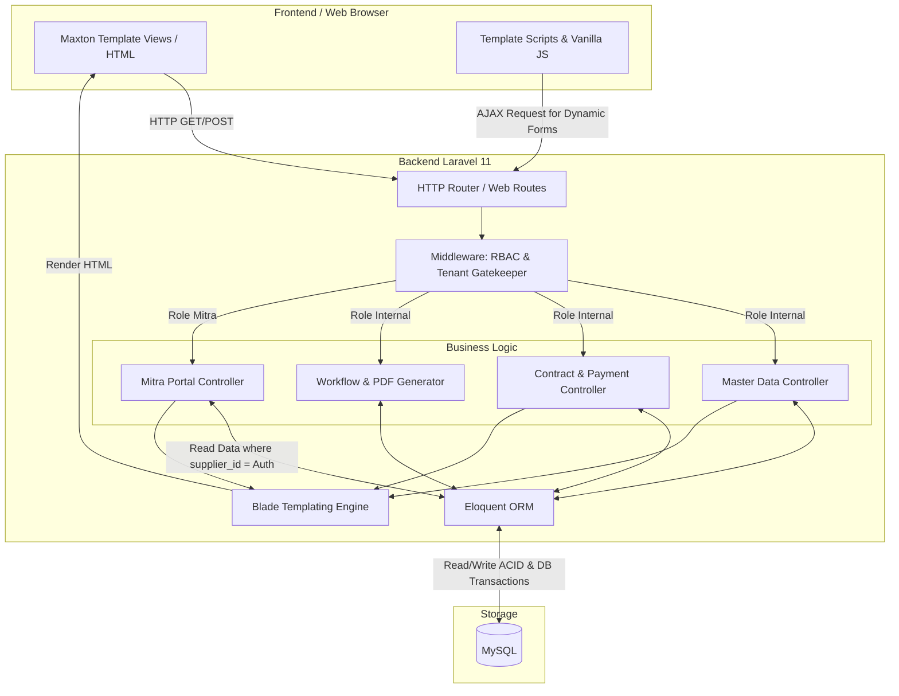

# PRODUCT REQUIREMENTS DOCUMENT (PRD)
**Sistem Informasi Manajemen Keuangan & Tagihan**
**BLU kantor UPBU Kelas I A.P.T. Pranoto - Samarinda**

## 1. Project Overview
Sistem Informasi Manajemen Keuangan & Tagihan adalah aplikasi *Enterprise Resource Planning* (ERP) skala instansi berbasis web yang dirancang untuk mendigitalisasi, mengotomatisasi, dan mengamankan seluruh tata kelola kontrak pihak ketiga, pencatatan Buku Kas Umum (BKU), perhitungan pajak, dan birokrasi pembayaran (SPP, SPM, NPI, SP2D) di lingkungan Badan Layanan Umum (BLU) Bandara A.P.T. Pranoto.

## 2. Technology Stack
* **Backend Framework:** Laravel 11 (PHP)
* **Frontend UI/View:** Laravel Blade (menggunakan *template* HTML **Maxton**)
* **DOM Manipulation/Interactivity:** Vanilla JavaScript / jQuery (sesuai bawaan template Maxton, untuk fitur *Dynamic Generator* tanpa *reload*)
* **Database:** MySQL (relasional penuh dengan *DB Transactions* & *ACID compliance*)
* **Role-Based Access Control (RBAC):** `spatie/laravel-permission`
* **PDF Generator:** `barryvdh/laravel-dompdf` (Format A4 standar pemerintah)
* **Data Visualization:** Menggunakan *library* grafik bawaan Maxton (seperti ApexCharts/Chart.js)

## 3. User Roles & Permissions (13 Strict Roles)
Sistem menggunakan *Gatekeeper* RBAC yang ketat. Akses menu dan aksi (CRUD/Approval) dibatasi secara spesifik:
1. **Super Admin:** Akses penuh ke pengaturan sistem.
2. **KPA (Kuasa Pengguna Anggaran):** Pantauan tingkat tinggi (*Dashboard Executive*).
3. **Kepala Subbagian Keuangan dan Tata Usaha:** Pantauan tingkat tinggi (Akses setara KPA).
4. **Kepala Seksi Pelayanan dan Kerjasama:** Pantauan tingkat tinggi (Akses setara KPA).
5. **PPK (Pejabat Pembuat Komitmen):** *Approval* Kontrak, Addendum, dan Dokumen SPP. Verifikator utama *Karmon*.
6. **PPSPM (Pejabat Penanda Tangan SPM):** *Approval* Dokumen SPM.
7. **Bendahara Pengeluaran:** *Approval* pencairan, pembuat NPI, eksekutor SP2D, dan pengelola BKU.
8. **Bendahara Penerimaan:** *Approval* NPI (Pemindahbukuan antar rekening BLU).
9. **Pejabat Pengadaan:** Input/Pembuat draf Kontrak dan Addendum dan input data supplier.
10. **Operator BLU:** Input tagihan Vendor (Non-Remunerasi/Pihak Ketiga) dan pembuat draf SPP.
11. **PPABP:** Input tagihan Belanja Pegawai/Honor.
12. **Operator Perjaldin:** Input tagihan Perjalanan Dinas.
13. **Mitra / Vendor:** Akses eksternal (*Read-Only*) terisolasi untuk melacak status tagihan kontrak mereka.

## 4. Core Modules & Features

### Modul 0: Authentication & Access Control
* **Sistem Login Utama:** Menggunakan autentikasi bawaan Laravel (Session-based Auth).
* **Smart Role-Based Redirect:** Setelah autentikasi berhasil, sistem wajib mengecek *role* dari *user* (menggunakan Spatie) dan mengarahkannya ke *dashboard* yang tepat (Contoh: `Mitra` ke `/mitra/dashboard`, internal ke `/internal/dashboard`).
* **Proteksi Keamanan:** Menggunakan *Rate Limiting* (Throttle) untuk mencegah *brute-force*.

### Modul 1: Master Data Management
* CRUD Data Pegawai & Pejabat.
* CRUD Data Supplier / Mitra / Rekanan (termasuk data NPWP dan Rekening Bank).
* CRUD Data Pagu Anggaran (DIPA, MAK/COA) dan riwayat revisinya.

### Modul 2: Contract Management
* **Input Kontrak Baru:** Dilengkapi fitur **Dynamic Termin Generator** (menggunakan JS untuk *generate* baris termin dan persentase secara otomatis tanpa *reload*).
* **Manajemen Addendum:** Halaman komparasi *Before vs After* untuk perubahan nilai/waktu kontrak.
* **Master-Detail View (360-Degree):** Satu halaman terpadu yang menggabungkan:
  * **Resume Kontrak:** Profil dan ringkasan informasi kontrak.
  * **Karmon (Kartu Monitoring):** Melacak sisa pagu, masa berlaku jaminan, dan jadwal termin.
  * **Realisasi:** Menampilkan riwayat pembayaran termin yang sudah berstatus SP2D.

### Modul 3: Payment & Tax Engine
* **Pemisahan Form Transaksi:** *Routing* dan *View* dipisah berdasarkan *Role* (Vendor oleh Operator BLU, Honor oleh PPABP, Perjaldin oleh Operator Perjaldin).
* **Auto-Tax Calculator (JS):** Kalkulasi seketika (Bruto -> Potongan PPN/PPh -> Netto) beserta potongan "Angsuran Uang Muka" di sisi *client* sebelum *submit* form.
* **Relasi Database Pajak:** Menggunakan tabel `transaction_taxes` (*One-to-Many*) untuk menyimpan lebih dari satu jenis pajak per transaksi.

### Modul 4: Approval Workflow Engine & PDF Generation
* **State Machine Dokumen:** Draft -> SPP (Menunggu PPK) -> SPM (Menunggu PPSPM) -> NPI (Menunggu Bendahara) -> SP2D (Cair).
* **Strict Audit Trail:** Setiap aksi *Approve/Reject* wajib tersimpan di tabel `approval_logs` (menyimpan ID Dokumen, User, Role, Waktu, dan Catatan).
* **Cetak Dokumen Otomatis:** Mengubah data tabel menjadi *file* PDF berformat resmi pemerintah (SPP, SPM, NPI, SP2D).

### Modul 5: Dashboards Internal & Reporting
* **Dashboard KPA:** Visualisasi data *real-time* (ApexCharts) membandingkan Pagu Awal vs Realisasi Belanja, dan menampilkan kartu antrean persetujuan.
* **Buku Kas Umum (BKU):** Laporan buku besar otomatis (*Read-Only*). Transaksi bruto dicatat sebagai *Pengeluaran*, dan potongan pajak dicatat sebagai *Penerimaan Titipan*.
* **Laporan Karmon & Realisasi:** Fitur *export* *DataTable* ke Excel/PDF untuk kebutuhan audit.

### Modul 6: Portal Mitra (External Dashboard)
* **Strict Tenant Isolation:** Keamanan tingkat tinggi; Mitra **hanya** bisa melihat data yang memiliki `supplier_id` milik mereka.
* **Visual Timeline Tracker:** Membaca data dari `approval_logs` dan menampilkannya sebagai pelacak visual ala *e-commerce* (mengetahui dokumen sedang nyangkut di meja siapa).
* **Read-Only Interface:** Tidak ada tombol *Action* (CRUD), hanya ada fungsi unduh dokumen bukti potong pajak / bukti transfer (SP2D).

## 5. System Architecture Diagram (Monolith Blade Stack)

Sistem ini menggunakan arsitektur MVC Monolith klasik dari Laravel. Seluruh proses *rendering* HTML dilakukan di sisi server (Server-Side Rendering) menggunakan Blade template.

## 6. STRICT AI UI/UX DIRECTIVES (Wajib Dibaca oleh AI Agent)
Untuk seluruh implementasi antarmuka (UI) pada proyek ini, AI Agent **WAJIB** mematuhi aturan berikut:

1. **NO CUSTOM COMPONENTS:** AI DILARANG KERAS membuat komponen UI, *class* CSS, atau elemen desain sendiri dari nol. 
2. **STRICT TEMPLATE USAGE:** AI WAJIB mencari dan menggunakan struktur HTML, penamaan *class* (class names), dan hierarki elemen yang sudah disediakan oleh template **Maxton**. 
3. **COMPONENT MAPPING:** * Jika membuat form input, gunakan struktur *Form Group / Input / Select* bawaan Maxton.
   * Jika membuat tabel, gunakan struktur *DataTables / Table* bawaan Maxton.
   * Jika membuat notifikasi atau peringatan, gunakan komponen *Alert / Toast / Modal* bawaan Maxton.
   * Jika membuat *layout* halaman, gunakan kerangka *Header, Sidebar, Breadcrumb, dan Card* bawaan Maxton.
4. **INTEGRATION ONLY:** Tugas AI hanyalah menyisipkan sintaks Blade (`{{ $data }}`, `@foreach`, `@if`, `@role`) ke dalam *file* HTML Maxton yang sudah ada, serta menambahkan logika *Vanilla JS* untuk interaktivitas spesifik (seperti *Dynamic Termin Generator*) TANPA merusak *style* bawaan.
5. **AUTHENTICATION & ERROR PAGES:** Untuk halaman Login, Lupa Password, serta halaman Error (403 Forbidden, 404 Not Found, 500 Server Error), AI Agent WAJIB menggunakan *file* HTML murni bawaan dari template Maxton. Tugas AI hanya mengubah form *action* HTML tersebut agar terhubung dengan *Controller* Laravel, bukan mendesain ulang *layout*-nya.