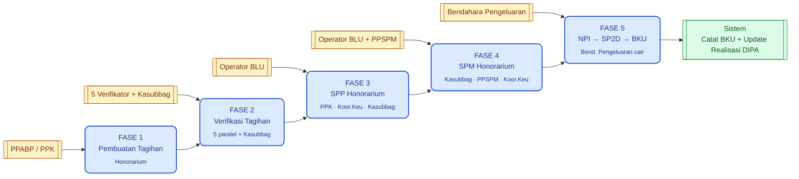
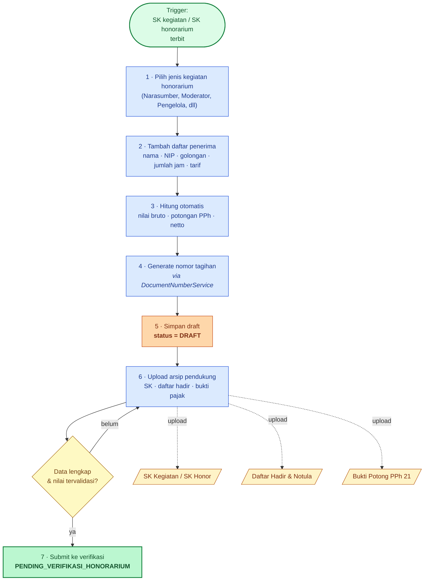
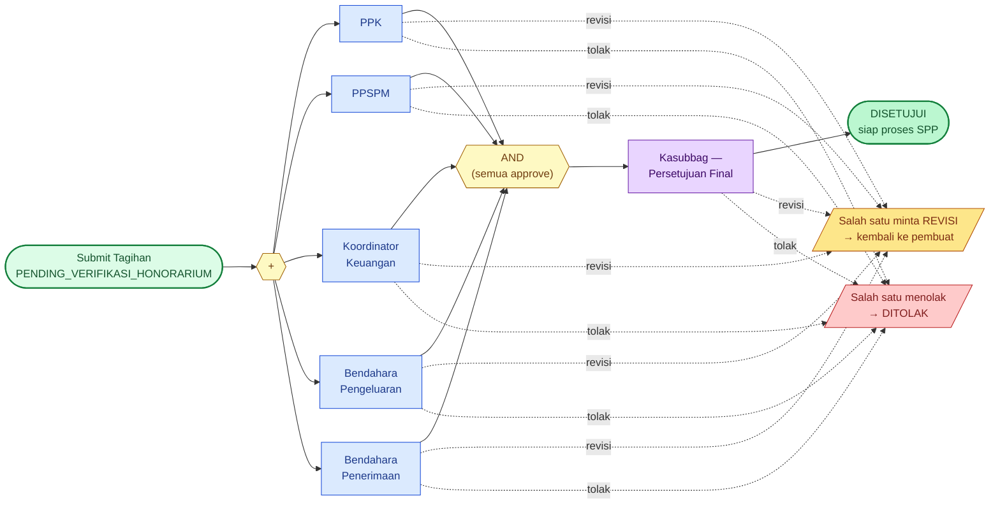
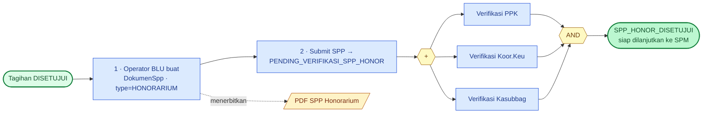
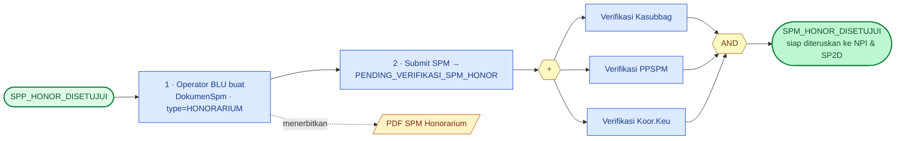
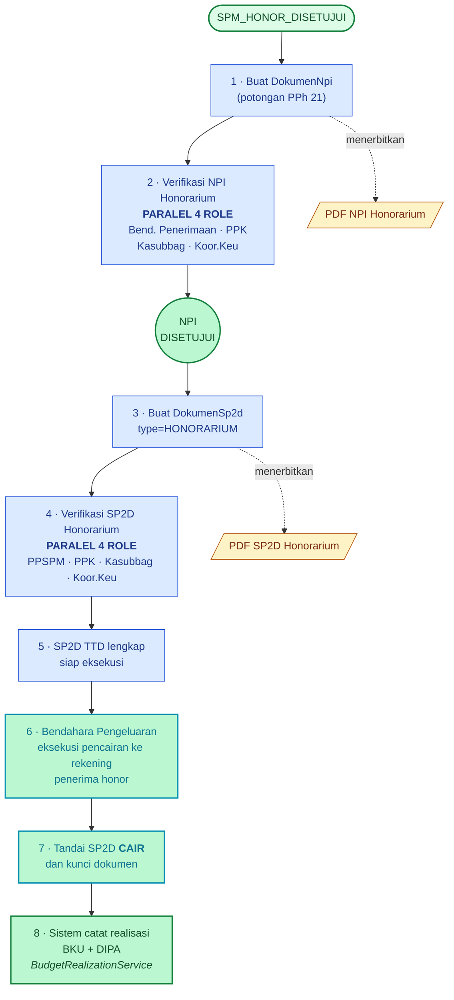
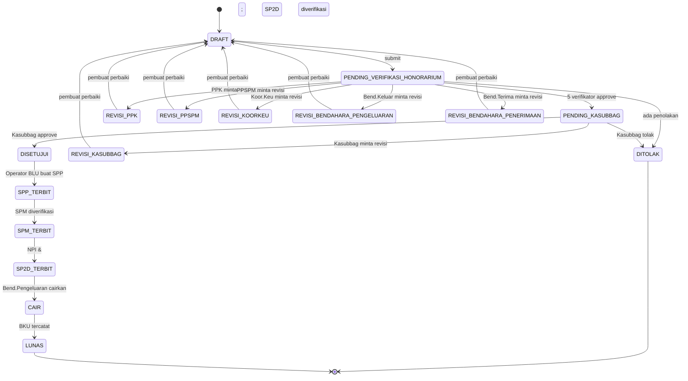
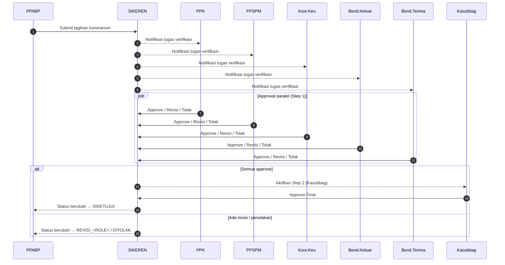

# Alur Proses Tagihan Honorarium (Sampai Pencairan SP2D)

> Dokumen ini memetakan alur lengkap dari pembuatan **Tagihan Honorarium** sampai
> dana cair ke pegawai/penerima dan tercatat di BKU.
>
> Diagram dibuat dengan **Mermaid** sehingga:
> - Tampil otomatis di GitHub, GitLab, VS Code, IntelliJ, Obsidian
> - Bersih (tidak ada garis silang) karena auto-layout
> - Bisa diimpor ke Draw.io: *Arrange → Insert → Advanced → Mermaid*
>
> **Sumber kode**:
> - `app/Http/Controllers/HonorariumController.php`,
>   `BendaharaHonorariumVerifikasiController.php`
> - `app/Services/TagihanHonorariumWorkflowService.php`
> - `database/seeders/WorkflowDefinitionSeeder.php` — definisi workflow
>   `TAGIHAN_HONORARIUM`, `SPP_HONORARIUM_PPK`, `SPM_HONORARIUM_PPSPM`,
>   `NPI_HONORARIUM`, `SP2D_HONORARIUM`
> - `app/Services/BudgetRealizationService.php` — pencatatan BKU saat SP2D cair

---

## Daftar Isi

1. [Phase Map (overview 5 fase)](#1-phase-map)
2. [Fase 1 — Pembuatan Tagihan Honorarium](#2-fase-1--pembuatan-tagihan-honorarium)
3. [Fase 2 — Verifikasi Tagihan (5 paralel + Kasubbag)](#3-fase-2--verifikasi-tagihan-honorarium)
4. [Fase 3 — SPP Honorarium](#4-fase-3--spp-honorarium)
5. [Fase 4 — SPM Honorarium](#5-fase-4--spm-honorarium)
6. [Fase 5 — NPI → SP2D → Pencairan & BKU](#6-fase-5--npi--sp2d--pencairan--bku)
7. [State Machine — Status Tagihan Honorarium](#7-state-machine--status-tagihan-honorarium)
8. [Sequence Diagram — Verifikasi Paralel Fase 2](#8-sequence-diagram--verifikasi-paralel-fase-2)
9. [Tabel Workflow & Role per Fase](#9-tabel-workflow--role-per-fase)
10. [Glosarium](#10-glosarium)

---

## 1. Phase Map

Peta tinggi-level lima fase. Pakai sebagai indeks visual sebelum membaca diagram detail.

---

## 2. Fase 1 — Pembuatan Tagihan Honorarium

PPABP (atau PPK) menyiapkan daftar honorarium per pegawai/komponen, melengkapi
dokumen pendukung (SK, daftar hadir, SPK kegiatan, bukti potongan pajak), lalu
men-submit ke alur verifikasi.

> **Validasi penting di Fase 1** (`HonorariumController::store`):
> - Setiap baris detail wajib memiliki **NIP/identitas penerima** yang valid.
> - Tarif harus diambil dari `MasterTarifHonorarium` (golongan + jenis kegiatan).
> - Total bruto = Σ(detail). Pajak otomatis dihitung dari `MasterTarifPajak`.
> - Sebelum submit, semua dokumen wajib diupload (SK, daftar hadir, bukti pajak).

---

## 3. Fase 2 — Verifikasi Tagihan Honorarium

Workflow `TAGIHAN_HONORARIUM` (lihat `WorkflowDefinitionSeeder`).
Step 1 berjalan **paralel oleh 5 verifikator** (semua wajib approve), Step 2
finalisasi oleh **Kasubbag**.

> **Catatan implementasi** (`TagihanHonorariumWorkflowService::pendingStatusForHonorarium`):
> - Status tagihan saat menunggu approval **paralel**: `PENDING_VERIFIKASI_HONORARIUM`
>   (bukan per role) — lebih ringkas karena 5 role dapat ditemui sekaligus.
> - Setelah 5 verifikator approve, status berpindah ke `PENDING_KASUBBAG`.
> - Setelah Kasubbag approve → `DISETUJUI`, otomatis dapat diproses ke Fase 3.
> - Jika ada satu verifikator yang minta revisi atau menolak, instance status
>   workflow berpindah ke `REVISION` / `REJECTED`, status dokumen menjadi
>   `REVISI_<ROLE>` / `DITOLAK_<ROLE>`.

---

## 4. Fase 3 — SPP Honorarium

Operator BLU membuat **Surat Perintah Pembayaran (SPP)** dari tagihan yang
sudah `DISETUJUI`. Workflow `SPP_HONORARIUM_PPK` memverifikasi SPP secara
**paralel** oleh **PPK · Koordinator Keuangan · Kasubbag**.

> **Validasi penting di Fase 3** (`SppController::storeHonorarium`):
> - SPP hanya bisa dibuat kalau tagihan `status = DISETUJUI`.
> - Nomor SPP digenerate via `DocumentNumberService` dengan tipe `SPP_HONOR`.
> - Total SPP harus = total netto tagihan honorarium.
> - PDF SPP otomatis di-stream dari template Blade `dokumen-spp.honorarium`.

---

## 5. Fase 4 — SPM Honorarium

Operator BLU melanjutkan dengan membuat **Surat Perintah Membayar (SPM)** dari
SPP yang sudah disetujui. Workflow `SPM_HONORARIUM_PPSPM` memverifikasi SPM
**paralel** oleh **Kasubbag · PPSPM · Koordinator Keuangan**.

> **Catatan implementasi**:
> - Urutan tampilan TTD pada PDF SPM Honor: Kasubbag → PPSPM → Koordinator
>   Keuangan, sesuai dengan order step pada workflow `SPM_HONORARIUM_PPSPM`.
> - Jika satu verifikator minta revisi, dokumen di-rollback ke draft tanpa
>   menghilangkan history TTD verifikator lainnya.

---

## 6. Fase 5 — NPI → SP2D → Pencairan & BKU

Tahap akhir: **NPI** (Nota Pemindahbukuan Internal) untuk potongan pajak,
**SP2D** sebagai surat perintah pencairan, dan pencatatan otomatis ke BKU.

> **Pencatatan BKU** (`BudgetRealizationService`):
> - Saat SP2D ditandai `CAIR`, service otomatis membuat baris di
>   `realisasi_anggaran` (mengikat ke `master_dipa_id` pada tagihan honor).
> - `sisa_pagu` di tabel `master_dipa` ikut berkurang sesuai nilai netto.
> - Mutasi muncul di laporan **BKU** (`reports.bku`) dan **Realisasi DIPA**.

---

## 7. State Machine — Status Tagihan Honorarium

Diagram status tagihan honorarium dari `DRAFT` sampai `LUNAS` (cair). Tiap
panah merepresentasikan transisi yang dipicu oleh aksi manual (workflow) atau
event sistem.

---

## 8. Sequence Diagram — Verifikasi Paralel Fase 2

Detil interaksi 5 verifikator + Kasubbag pada **Fase 2** (sumber:
`TagihanHonorariumWorkflowService::approveCurrentStep`).

---

## 9. Tabel Workflow & Role per Fase

| Fase | Workflow Definition | Step (urutan) | Role | Sifat |
|---|---|---|---|---|
| 2 | `TAGIHAN_HONORARIUM` | 1 (paralel) | PPK · PPSPM · Koor.Keu · Bend.Pengeluaran · Bend.Penerimaan | semua wajib approve |
| 2 | `TAGIHAN_HONORARIUM` | 2 (final) | Kasubbag | finalisasi |
| 3 | `SPP_HONORARIUM_PPK` | 1 (paralel) | PPK · Koor.Keu · Kasubbag | semua wajib approve |
| 4 | `SPM_HONORARIUM_PPSPM` | 1 (paralel) | Kasubbag · PPSPM · Koor.Keu | semua wajib approve |
| 5 | `NPI_HONORARIUM` | 1 (paralel) | Bend.Penerimaan · PPK · Kasubbag · Koor.Keu | semua wajib approve |
| 5 | `SP2D_HONORARIUM` | 1 (paralel) | PPSPM · PPK · Kasubbag · Koor.Keu | semua wajib approve |

> Catatan: meskipun nilai `urutan_step = 1` untuk seluruh role di setiap workflow,
> validasi `is_required = true` membuat workflow hanya boleh berlanjut setelah
> **semua role pada urutan tersebut approve** (logika paralel AND).

---

## 10. Glosarium

| Singkatan | Kepanjangan / Arti |
|---|---|
| **BAPP / BAST / BAP** | Berita Acara Pemeriksaan / Serah Terima / Pembayaran (khusus tagihan kontrak; tidak dipakai di honorarium). |
| **BKU** | Buku Kas Umum — catatan kas masuk/keluar BLU. |
| **DIPA** | Daftar Isian Pelaksanaan Anggaran — pagu yang dipakai sebagai sumber pembayaran honorarium. |
| **NPI** | Nota Pemindahbukuan Internal — dokumen pembukuan potongan PPh 21 honorarium. |
| **PPABP** | Petugas Pengelola Administrasi Belanja Pegawai — penyiap data honorarium. |
| **PPK** | Pejabat Pembuat Komitmen. |
| **PPSPM** | Pejabat Penandatangan Surat Perintah Membayar. |
| **SP2D** | Surat Perintah Pencairan Dana. |
| **SPM** | Surat Perintah Membayar. |
| **SPP** | Surat Perintah Pembayaran. |
| **Kasubbag** | Kepala Subbagian Keuangan dan Tata Usaha. |
| **Koor.Keu** | Koordinator Keuangan. |
| **Bend.Pengeluaran / Bend.Penerimaan** | Bendahara Pengeluaran / Penerimaan. |
