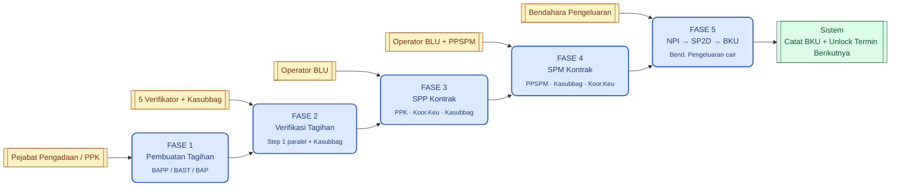
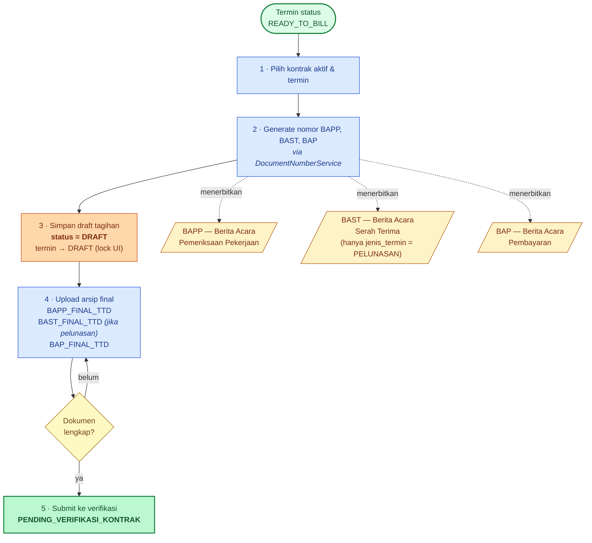
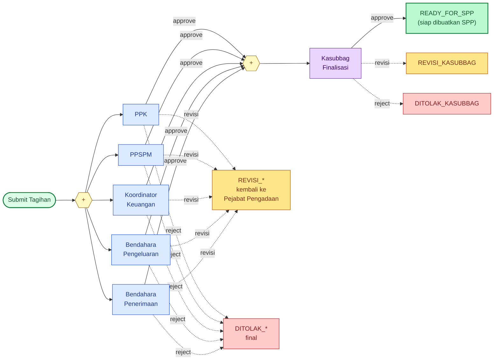
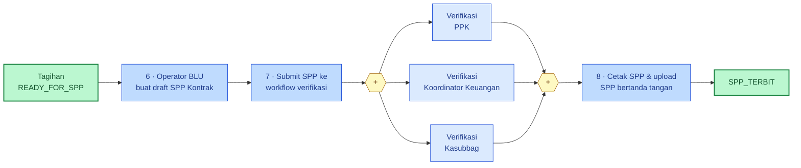
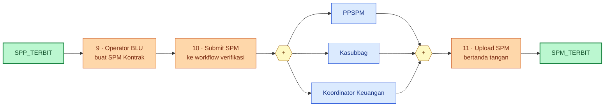
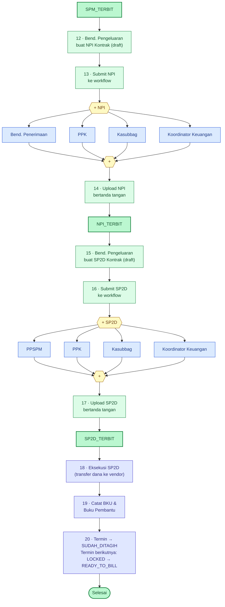
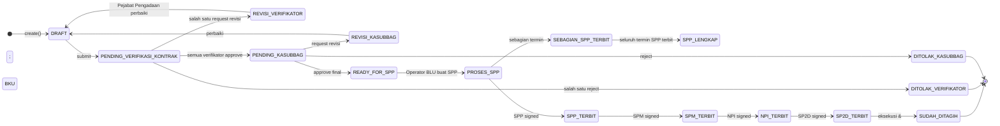
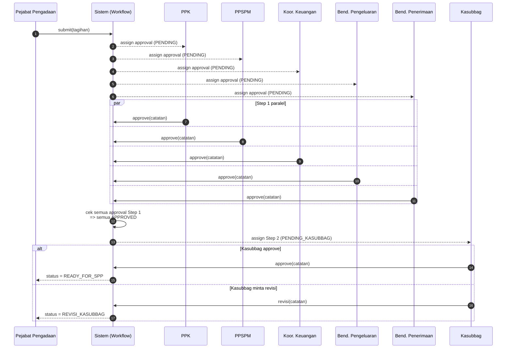

# Alur Proses Tagihan Kontrak (BAST / Termin)

> Dokumen ini memetakan alur lengkap dari pembuatan tagihan kontrak BAST/Termin
> sampai dana cair ke vendor dan tercatat di BKU.
>
> Diagram dibuat dengan **Mermaid** sehingga:
> - Tampil otomatis di GitHub, GitLab, VS Code, IntelliJ, Obsidian
> - Bersih (tidak ada garis silang) karena auto-layout
> - Bisa diimpor ke Draw.io: *Arrange → Insert → Advanced → Mermaid*
>
> **Sumber kode**: `app/Http/Controllers/TagihanController.php`,
> `TagihanKontrakVerifikasiController.php`, `TagihanKontrakWorkflowService.php`,
> `database/seeders/WorkflowDefinitionSeeder.php`,
> `app/Models/DokumenSp2d.php` (auto-unlock termin berikutnya).

---

## Daftar Isi

1. [Phase Map (overview 5 fase)](#1-phase-map)
2. [Fase 1 — Pembuatan Tagihan](#2-fase-1--pembuatan-tagihan)
3. [Fase 2 — Verifikasi Tagihan (Step 1 paralel + Step 2 Kasubbag)](#3-fase-2--verifikasi-tagihan)
4. [Fase 3 — SPP Kontrak](#4-fase-3--spp-kontrak)
5. [Fase 4 — SPM Kontrak](#5-fase-4--spm-kontrak)
6. [Fase 5 — NPI → SP2D → BKU](#6-fase-5--npi--sp2d--bku)
7. [State Machine — Status Tagihan](#7-state-machine--status-tagihan)
8. [Sequence Diagram — Verifikasi Paralel](#8-sequence-diagram--verifikasi-paralel)
9. [Tabel Status & Dokumen](#9-tabel-referensi)
10. [Glosarium](#10-glosarium)

---

## 1. Phase Map

Peta tinggi-level 5 fase. Pakai ini sebagai indeks visual sebelum membaca diagram detail.



---

## 2. Fase 1 — Pembuatan Tagihan

Pejabat Pengadaan / PPK membuat draft tagihan dari termin yang sudah berstatus
`READY_TO_BILL`, lalu melengkapi dokumen final BAPP, BAST (jika pelunasan), dan BAP.



> **Validasi penting di Fase 1** (`TagihanController::storeKontrak`):
> - Termin harus `READY_TO_BILL`.
> - Draft tagihan tidak boleh ganda untuk termin yang sama (`DetailKontrak.kontrak_termin_id` unik).
> - Nilai bruto yang dikirim klien harus cocok dengan `nilai_bruto_termin` di backend (toleransi 1 rupiah).
> - Jika `jenis_termin = PELUNASAN`, BAST wajib di-input.

---

## 3. Fase 2 — Verifikasi Tagihan

Workflow `TAGIHAN_KONTRAK_VERIFIKATOR` dari `WorkflowDefinitionSeeder`.
Step 1 = 5 verifikator paralel (semua wajib approve), Step 2 = Kasubbag finalisasi.



> **Aturan**:
> - Semua role di Step 1 **wajib** approve (`is_required = true`) sebelum Step 2 dieksekusi.
> - Setiap role boleh `request revision` (loop balik ke Pejabat Pengadaan) atau `reject` (workflow stop).
> - `TagihanKontrakWorkflowService::syncTagihanStatus()` memetakan keputusan terakhir ke status tagihan
>   (`PENDING_<ROLE>`, `REVISI_<ROLE>`, `DITOLAK_<ROLE>`, `READY_FOR_SPP`).

---

## 4. Fase 3 — SPP Kontrak

Operator BLU membuat SPP berdasarkan tagihan `READY_FOR_SPP`. Verifikasi paralel
di workflow `SPP_KONTRAK_PPK` melibatkan PPK, Koordinator Keuangan, Kasubbag.



---

## 5. Fase 4 — SPM Kontrak

Workflow `SPM_KONTRAK_PPSPM`: PPSPM, Kasubbag, Koordinator Keuangan (paralel).



---

## 6. Fase 5 — NPI → SP2D → BKU

Bendahara Pengeluaran membuat NPI dan SP2D. Workflow `NPI_KONTRAK` dan
`SP2D_KONTRAK` punya 4 verifikator paralel.



> **Auto-unlock termin berikutnya** (`app/Models/DokumenSp2d.php`): saat SP2D
> sebuah termin dieksekusi, sistem mencari termin selanjutnya di kontrak yang sama
> dan mengubah `status_termin` dari `LOCKED` ke `READY_TO_BILL`. Sehingga kontrak
> multi-termin bisa langsung mulai siklus berikutnya.

---

## 7. State Machine — Status Tagihan

Transisi status tagihan kontrak (kolom `tagihans.status`).



> Catatan: `REVISI_VERIFIKATOR`/`DITOLAK_VERIFIKATOR` di atas adalah kelompok placeholder.
> Status sebenarnya bersuffix nama role: `REVISI_PPK`, `REVISI_PPSPM`,
> `REVISI_KOORDINATOR_KEUANGAN`, `REVISI_BENDAHARA_PENGELUARAN`,
> `REVISI_BENDAHARA_PENERIMAAN` (dan `DITOLAK_*` yang setara).

---

## 8. Sequence Diagram — Verifikasi Paralel

Cara workflow paralel bekerja dari sudut interaksi pemain.



> Jika salah satu Step 1 minta revisi atau reject, `SYS` langsung men-set status
> tagihan ke `REVISI_<ROLE>` / `DITOLAK_<ROLE>` tanpa menunggu approval lain selesai.

---

## 9. Tabel Referensi

### 9.1 Workflow Definition (kode → step)

| Kode workflow                  | Target dokumen      | Step 1 (paralel)                                           | Step 2     |
|--------------------------------|---------------------|------------------------------------------------------------|------------|
| `TAGIHAN_KONTRAK_VERIFIKATOR`  | `Tagihan` (kontrak) | PPK · PPSPM · Koor.Keu · Bend.Pengeluaran · Bend.Penerimaan | Kasubbag   |
| `SPP_KONTRAK_PPK`              | `DokumenSpp`        | PPK · Koor.Keu · Kasubbag                                  | —          |
| `SPM_KONTRAK_PPSPM`            | `DokumenSpm`        | PPSPM · Kasubbag · Koor.Keu                                | —          |
| `NPI_KONTRAK`                  | `DokumenNpi`        | Bend.Penerimaan · PPK · Kasubbag · Koor.Keu                | —          |
| `SP2D_KONTRAK`                 | `DokumenSp2d`       | PPSPM · PPK · Kasubbag · Koor.Keu                          | —          |

> Walaupun Step 1 berisi banyak role, workflow non-tagihan di atas memakai
> `urutan_step = 1` untuk semuanya, sehingga seluruhnya paralel dan
> tidak ada Step 2 final.

### 9.2 Status `tagihans.status`

| Status                          | Arti                                                  | Berhenti di sini? |
|---------------------------------|-------------------------------------------------------|-------------------|
| `DRAFT`                         | Baru dibuat, belum di-submit                          | tidak             |
| `PENDING_VERIFIKASI_KONTRAK`    | Menunggu Step 1 (5 verifikator)                       | tidak             |
| `REVISI_<ROLE>`                 | Verifikator role tsb minta revisi                     | tidak (loop)      |
| `DITOLAK_<ROLE>`                | Verifikator role tsb reject                           | ya (final)        |
| `PENDING_KASUBBAG`              | Step 1 lulus, menunggu Kasubbag                       | tidak             |
| `REVISI_KASUBBAG` / `DITOLAK_KASUBBAG` | Outcome Step 2                                  | tidak / ya        |
| `READY_FOR_SPP`                 | Disetujui semua, siap dibuatkan SPP                   | tidak             |
| `PROSES_SPP`                    | Sudah ada SPP draft / sebagian termin diproses        | tidak             |
| `SEBAGIAN_SPP_TERBIT`           | Beberapa termin sudah SPP                             | tidak             |
| `SPP_LENGKAP`                   | Semua termin SPP terbit                               | tidak             |
| `SPP_TERBIT` / `SPM_TERBIT` / `NPI_TERBIT` / `SP2D_TERBIT` | Tahap dokumen   | tidak             |
| `SUDAH_DITAGIH`                 | SP2D dieksekusi + tercatat BKU                        | ya (selesai)      |

### 9.3 Status `kontrak_termin.status_termin`

| Status            | Kondisi                                                                       |
|-------------------|-------------------------------------------------------------------------------|
| `LOCKED`          | Termin belum aktif. Akan unlock ketika termin sebelumnya `SUDAH_DITAGIH`.     |
| `READY_TO_BILL`   | Bisa dibuatkan tagihan (state default termin pertama setelah kontrak aktif).  |
| `DRAFT`           | Sudah ada draft tagihan; mencegah pembuatan duplikat.                         |
| `SUDAH_DITAGIH`   | SP2D termin ini sudah dieksekusi.                                             |

### 9.4 Dokumen yang dihasilkan

| Dokumen | Sumber kode (Document Number Key) | Wajib?                             |
|---------|-----------------------------------|-------------------------------------|
| BAPP    | `DocumentNumberService::generateByKey('BAPP')` | Selalu                  |
| BAST    | `DocumentNumberService::generateByKey('BAST')` | Hanya `jenis_termin = PELUNASAN` |
| BAP     | `DocumentNumberService::generateByKey('BAP')`  | Selalu                  |
| SPP, SPM, NPI, SP2D | masing-masing dari workflow modul terkait | Selalu          |

---

## 10. Glosarium

- **BAPP** — *Berita Acara Pemeriksaan Pekerjaan*. Pemeriksaan hasil pekerjaan oleh tim pemeriksa.
- **BAST** — *Berita Acara Serah Terima*. Penyerahan akhir pekerjaan dari penyedia ke PA/KPA.
- **BAP** — *Berita Acara Pembayaran*. Dokumen dasar pembayaran.
- **SPP** — *Surat Permintaan Pembayaran*. Dibuat Operator BLU, ditujukan ke PPSPM.
- **SPM** — *Surat Perintah Membayar*. Dibuat Operator BLU dari SPP yang sudah disetujui PPSPM.
- **NPI** — *Nota Pemindahbukuan Internal*. Pemindahbukuan internal kas BLU.
- **SP2D** — *Surat Perintah Pencairan Dana*. Pencairan ke rekening vendor.
- **BKU** — *Buku Kas Umum*. Pencatatan akuntansi bendahara.
- **PPK** — *Pejabat Pembuat Komitmen*.
- **PPSPM** — *Pejabat Penanda-tangan SPM*.
- **PPABP** — *Pejabat Pengelola Administrasi Belanja Pegawai* (untuk honor).
- **DIPA** — *Daftar Isian Pelaksanaan Anggaran*.

---

## Cara melihat / mengekspor diagram

- **GitHub / GitLab / VS Code**: blok ```` ```mermaid ```` otomatis dirender.
- **VS Code**: install ekstensi *Markdown Preview Mermaid Support* untuk live preview.
- **Draw.io / diagrams.net**: buka *Arrange → Insert → Advanced → Mermaid*, paste isi
  blok mermaid yang diinginkan, klik *Insert*. Hasil dapat di-edit lebih lanjut sebagai shape.
- **PNG / SVG**: dari Mermaid Live Editor (<https://mermaid.live>) — paste, lalu *Actions → Download*.
