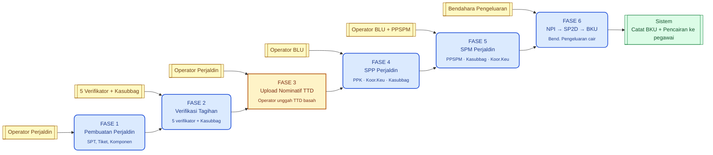
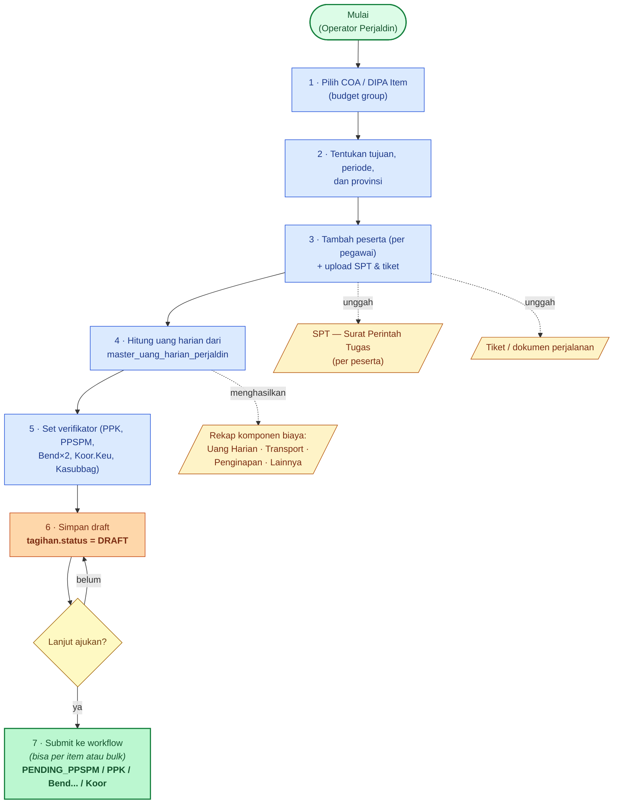
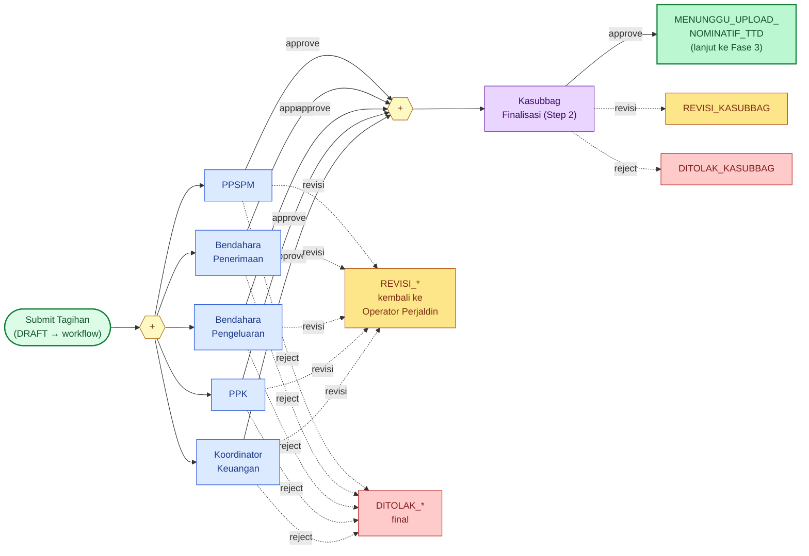
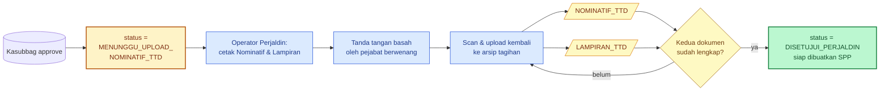
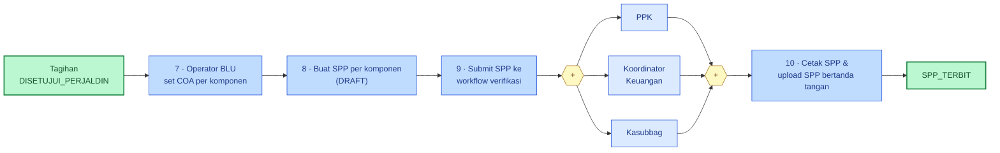
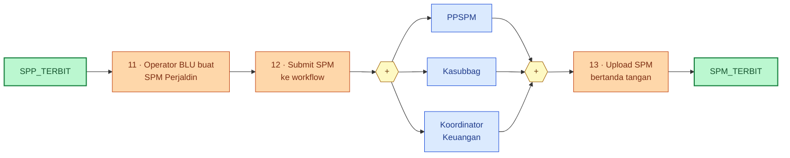
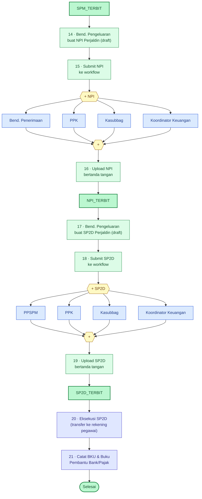
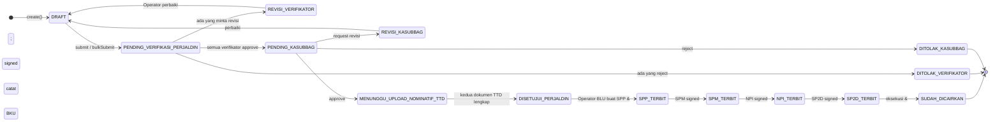

# Alur Proses Tagihan Perjalanan Dinas (Perjaldin)

> Dokumentasi alur lengkap dari pembuatan SPT/perjaldin oleh Operator Perjaldin
> hingga dana cair ke pegawai dan tercatat di BKU.
>
> Konsisten format dengan dokumen
> [`flow-tagihan-kontrak.md`](flow-tagihan-kontrak.md) — pakai **Mermaid**:
> tampil di GitHub/VS Code, versi-able di Git, dan bisa di-import ke Draw.io
> via *Arrange → Insert → Advanced → Mermaid*.
>
> **Sumber kode**:
> - `app/Http/Controllers/PerjaldinController.php`
> - `app/Http/Controllers/PerjaldinVerifikasiController.php`
> - `app/Services/PerjaldinWorkflowService.php` (`syncTagihanStatus()`)
> - `database/seeders/SppPerjaldinWorkflowSeeder.php`
> - `database/seeders/WorkflowDefinitionSeeder.php` (SPM/NPI/SP2D Perjaldin)
> - `resources/views/verifikasi_perjaldin/partials/status-badge.blade.php` (pemetaan status)

---

## Daftar Isi

1. [Phase Map (overview 6 fase)](#1-phase-map)
2. [Fase 1 — Pembuatan Perjaldin oleh Operator](#2-fase-1--pembuatan-perjaldin)
3. [Fase 2 — Verifikasi Perjaldin (Step 1 paralel + Kasubbag)](#3-fase-2--verifikasi-perjaldin)
4. [Fase 3 — Upload Nominatif TTD (gate sebelum SPP)](#4-fase-3--upload-nominatif-ttd)
5. [Fase 4 — SPP Perjaldin](#5-fase-4--spp-perjaldin)
6. [Fase 5 — SPM Perjaldin](#6-fase-5--spm-perjaldin)
7. [Fase 6 — NPI → SP2D → BKU](#7-fase-6--npi--sp2d--bku)
8. [State Machine Status Tagihan Perjaldin](#8-state-machine--status-tagihan-perjaldin)
9. [Sequence Diagram — Verifikasi Paralel + Kasubbag](#9-sequence-diagram--verifikasi-paralel)
10. [Tabel Referensi](#10-tabel-referensi)
11. [Glosarium](#11-glosarium)
12. [Perbedaan dengan Tagihan Kontrak](#12-perbedaan-dengan-tagihan-kontrak)

---

## 1. Phase Map



> Fase 3 punya warna kuning (gate) karena merupakan **gating manual** —
> tagihan menunggu Operator mengunggah dokumen sebelum pencairan dimulai.

---

## 2. Fase 1 — Pembuatan Perjaldin



> **Validasi** (`PerjaldinController::store` & `update`):
> - Tagihan boleh diedit hanya jika status ada di `editablePerjaldinStatuses()` (DRAFT / REVISI_*).
> - Setiap perubahan saat edit me-reset status ke `DRAFT` agar workflow ulang dari awal.
> - File SPT & tiket disimpan di `storage/app/public/perjaldin/{spt,tiket}`.
> - `bulkSubmit()` mendukung pengajuan banyak tagihan sekaligus, error per-item tidak menggugurkan yang lain.

---

## 3. Fase 2 — Verifikasi Perjaldin

Workflow code `PERJALDIN` di `SppPerjaldinWorkflowSeeder`. Step 1 = 5 verifikator
paralel (semua wajib approve), Step 2 = Kasubbag finalisasi.



> **Aturan workflow** (`PerjaldinWorkflowService`):
> - Saat resubmit dari `REVISION`, semua approval di-reset (`urutan_step = 1` → PENDING, sisanya WAITING) dan instance dipindah ke `IN_PROGRESS`.
> - Step 2 baru aktif jika **seluruh** approval Step 1 berstatus `APPROVED`.
> - Kalau ada satu role yang `REVISION` atau `REJECTED`, instance langsung pindah status dan tidak menunggu role lain.

---

## 4. Fase 3 — Upload Nominatif TTD

Setelah Kasubbag approve, status tagihan **bukan langsung** `DISETUJUI_PERJALDIN`.
Operator Perjaldin harus mengunggah **dua dokumen TTD basah**:



> **Cek di `PerjaldinController::uploadNominatifTtd`** + helper
> `PerjaldinWorkflowService::hasNominatifTtdComplete($tagihan)`:
> - Setiap upload menonaktifkan arsip lama (`is_active = false`) dan mengaktifkan yang baru.
> - Jika kedua jenis (`NOMINATIF_TTD` + `LAMPIRAN_TTD`) aktif → status berubah ke
>   `DISETUJUI_PERJALDIN` dan Operator BLU akan mendapat notifikasi via
>   `TagihanReadyForSppNotificationService`.
> - Re-upload tetap diizinkan walau status sudah `DISETUJUI_PERJALDIN` (versi terbaru menggantikan).

---

## 5. Fase 4 — SPP Perjaldin

Operator BLU membuat SPP perjaldin per komponen biaya. Workflow code `SPP_PERJALDIN`:
3 verifikator paralel.



> Komponen perjaldin (uang harian, transport, penginapan, lainnya) diberi COA
> berbeda → biasanya menghasilkan **beberapa SPP** dari satu tagihan (per komponen).

---

## 6. Fase 5 — SPM Perjaldin

Workflow `SPM_PERJALDIN_PPSPM`: PPSPM, Kasubbag, Koor.Keu (paralel).



---

## 7. Fase 6 — NPI → SP2D → BKU

Workflow `NPI_PERJALDIN` & `SP2D_PERJALDIN` masing-masing punya 4 verifikator paralel.



> Beda dengan kontrak: **tidak ada termin** — pencairan langsung ke rekening
> pegawai (yang tercatat di `master_pegawai`) sebesar total perjaldin yang disetujui.

---

## 8. State Machine — Status Tagihan Perjaldin

Diturunkan dari `PerjaldinWorkflowService::syncTagihanStatus()` + status badge view.



> Placeholder `REVISI_VERIFIKATOR` / `DITOLAK_VERIFIKATOR` mewakili 5 status spesifik:
> `REVISI_PPSPM`, `REVISI_BENDAHARA_PENERIMAAN`, `REVISI_BENDAHARA_PENGELUARAN`,
> `REVISI_PPK`, `REVISI_KOORDINATOR_KEUANGAN` (dan `DITOLAK_*` setara).

---

## 9. Sequence Diagram — Verifikasi Paralel

```mermaid
sequenceDiagram
    autonumber
    participant OP as Operator Perjaldin
    participant SYS as Sistem (Workflow)
    participant PPSPM
    participant BPN as Bend. Penerimaan
    participant BP as Bend. Pengeluaran
    participant PPK as PPK
    participant KK as Koor. Keuangan
    participant KS as Kasubbag

    OP->>SYS: submit(tagihan) atau bulkSubmit
    SYS-->>PPSPM: assign approval (PENDING)
    SYS-->>BPN: assign approval (PENDING)
    SYS-->>BP: assign approval (PENDING)
    SYS-->>PPK: assign approval (PENDING)
    SYS-->>KK: assign approval (PENDING)

    par Step 1 paralel
        PPSPM->>SYS: approve(catatan)
    and
        BPN->>SYS: approve(catatan)
    and
        BP->>SYS: approve(catatan)
    and
        PPK->>SYS: approve(catatan)
    and
        KK->>SYS: approve(catatan)
    end

    SYS->>SYS: cek approval Step 1<br/>=> semua APPROVED
    SYS-->>KS: assign Step 2 (PENDING_KASUBBAG)

    alt Kasubbag approve
        KS->>SYS: approve(catatan)
        SYS-->>OP: status = MENUNGGU_UPLOAD_NOMINATIF_TTD
        OP->>SYS: upload Nominatif &amp; Lampiran TTD
        SYS-->>OP: status = DISETUJUI_PERJALDIN<br/>(notifikasi ke Operator BLU)
    else Kasubbag minta revisi
        KS->>SYS: revisi(catatan)
        SYS-->>OP: status = REVISI_KASUBBAG
    else Kasubbag reject
        KS->>SYS: reject(catatan)
        SYS-->>OP: status = DITOLAK_KASUBBAG (final)
    end
```

> Jika salah satu role di Step 1 minta revisi/reject, `SYS` langsung men-set status
> dan tidak menunggu role lain; resubmit oleh Operator akan me-reset semua approval Step 1
> menjadi PENDING.

---

## 10. Tabel Referensi

### 10.1 Workflow Definitions

| Kode workflow         | Target dokumen              | Step 1 (paralel)                                           | Step 2     |
|-----------------------|-----------------------------|------------------------------------------------------------|------------|
| `PERJALDIN`           | `Tagihan` (perjaldin)       | PPSPM · Bend.Penerimaan · Bend.Pengeluaran · PPK · Koor.Keu | Kasubbag   |
| `SPP_PERJALDIN`       | `DokumenSpp` (per komponen) | PPK · Koor.Keu · Kasubbag                                   | —          |
| `SPM_PERJALDIN_PPSPM` | `DokumenSpm`                | PPSPM · Kasubbag · Koor.Keu                                 | —          |
| `NPI_PERJALDIN`       | `DokumenNpi`                | Bend.Penerimaan · PPK · Kasubbag · Koor.Keu                 | —          |
| `SP2D_PERJALDIN`      | `DokumenSp2d`               | PPSPM · PPK · Kasubbag · Koor.Keu                           | —          |

### 10.2 Status `tagihans.status` (tipe = PERJALDIN)

| Status                              | Arti                                                  | Berhenti? |
|-------------------------------------|-------------------------------------------------------|-----------|
| `DRAFT`                             | Baru dibuat / barusan diedit                          | tidak     |
| `PENDING_VERIFIKASI_PERJALDIN`      | Step 1 paralel berjalan                               | tidak     |
| `PENDING_PPSPM`                     | Khusus PPSPM masih PENDING                            | tidak     |
| `PENDING_PPK`                       | Khusus PPK masih PENDING                              | tidak     |
| `PENDING_BENDAHARA_PENERIMAAN`      | Khusus Bend.Penerimaan masih PENDING                  | tidak     |
| `PENDING_BENDAHARA_PENGELUARAN`     | Khusus Bend.Pengeluaran masih PENDING                 | tidak     |
| `PENDING_KOORDINATOR_KEUANGAN`      | Khusus Koor.Keu masih PENDING                         | tidak     |
| `PENDING_KASUBBAG`                  | Step 2 (Kasubbag finalisasi)                          | tidak     |
| `REVISI_PPSPM` / `REVISI_PPK` / `REVISI_BENDAHARA_*` / `REVISI_KOORDINATOR_KEUANGAN` / `REVISI_KASUBBAG` | Verifikator minta revisi → balik ke Operator | tidak (loop) |
| `DITOLAK_*`                         | Verifikator menolak                                   | ya (final)|
| `MENUNGGU_UPLOAD_NOMINATIF_TTD`     | Verifikasi lulus, menunggu unggah Nominatif & Lampiran TTD | tidak |
| `DISETUJUI_PERJALDIN`               | Siap dibuatkan SPP                                    | tidak     |
| `SPP_TERBIT` / `SPM_TERBIT` / `NPI_TERBIT` / `SP2D_TERBIT` | Tahap dokumen pencairan         | tidak     |
| `SUDAH_DICAIRKAN`                   | SP2D dieksekusi & dicatat BKU                         | ya (selesai) |

### 10.3 Dokumen yang dihasilkan

| Dokumen              | Sumber                                                     | Wajib?   |
|----------------------|------------------------------------------------------------|----------|
| SPT                  | Diunggah Operator per peserta saat create                  | ya       |
| Tiket / dokumen perjalanan | Diunggah Operator per peserta                        | bila ada |
| Rekap komponen       | Dihasilkan otomatis dari master uang harian + form input   | ya       |
| Nominatif TTD        | Cetak PDF dari sistem → TTD basah → upload kembali         | ya       |
| Lampiran TTD         | Cetak PDF dari sistem → TTD basah → upload kembali         | ya       |
| SPP, SPM, NPI, SP2D  | Workflow modul terkait                                     | ya       |

### 10.4 Routes Operator Perjaldin (singkat)

| Method  | URL                              | Aksi                              |
|---------|----------------------------------|-----------------------------------|
| GET     | `/perjaldins`                    | Index — daftar tagihan perjaldin  |
| GET/POST| `/perjaldins/create`             | Form & store baru                 |
| GET/PUT | `/perjaldins/{id}/edit`          | Edit & update                     |
| DELETE  | `/perjaldins/{id}`               | Hapus (jika status memungkinkan)  |
| POST    | `/perjaldins/bulk-submit`        | Ajukan banyak perjaldin sekaligus |
| GET     | `/perjaldins/{id}/pdf`           | Cetak SPT/Nominatif/Lampiran      |
| POST    | `/perjaldins/{id}/upload-nominatif-ttd` | Upload Nominatif/Lampiran TTD |

---

## 11. Glosarium

- **SPT** — *Surat Perintah Tugas* perjalanan dinas.
- **Nominatif** — daftar pegawai yang menerima pembayaran perjaldin (per peserta + total).
- **Lampiran** — rincian biaya per peserta (uang harian, transport, penginapan, dll).
- **DIPA Item / COA** — kode anggaran yang membebani pengeluaran perjaldin.
- **Master Uang Harian Perjaldin** — tabel referensi tarif uang harian per provinsi/kelas.
- **SPP / SPM / NPI / SP2D / BKU** — lihat glosarium di [`flow-tagihan-kontrak.md`](flow-tagihan-kontrak.md#10-glosarium).

---

## 12. Perbedaan dengan Tagihan Kontrak

| Aspek                          | Tagihan Kontrak                                  | Tagihan Perjaldin                              |
|--------------------------------|--------------------------------------------------|------------------------------------------------|
| Pembuat                        | Pejabat Pengadaan / PPK                          | Operator Perjaldin                             |
| Sumber tagihan                 | Termin kontrak `READY_TO_BILL`                   | SPT yang dibuat operator                       |
| Dokumen pembuka                | BAPP, BAST (jika pelunasan), BAP                 | SPT + tiket per peserta                        |
| Workflow Step 1 (paralel)      | PPK · PPSPM · Koor.Keu · Bend×2                  | PPSPM · Bend.Penerimaan · Bend.Pengeluaran · PPK · Koor.Keu |
| Workflow Step 2                | Kasubbag                                          | Kasubbag                                        |
| Gate setelah Kasubbag          | Langsung `READY_FOR_SPP`                         | **Wajib upload Nominatif TTD + Lampiran TTD** dulu |
| Status final pra-SPP           | `READY_FOR_SPP`                                  | `DISETUJUI_PERJALDIN`                          |
| Verifikator SPP                | PPK · Koor.Keu · Kasubbag                        | PPK · Koor.Keu · Kasubbag                      |
| Pencairan                      | Ke rekening vendor                               | Ke rekening pegawai (per peserta)              |
| Multi-termin                   | Ya (auto-unlock termin berikutnya)               | Tidak — sekali jalan per perjaldin             |
| Bulk submit                    | Tidak                                             | Ya (`POST /perjaldins/bulk-submit`)            |

---

## Cara melihat / mengekspor

- **GitHub / GitLab / VS Code**: blok ```` ```mermaid ```` otomatis dirender.
- **Live editor**: paste blok di <https://mermaid.live> → *Actions → Download SVG/PNG*.
- **Draw.io**: *Arrange → Insert → Advanced → Mermaid* → paste → *Insert*.
